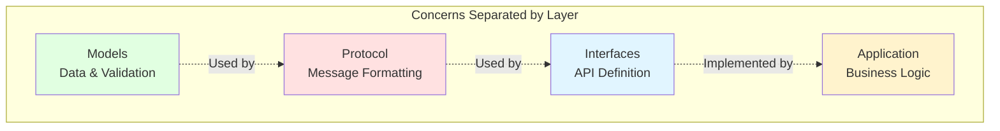
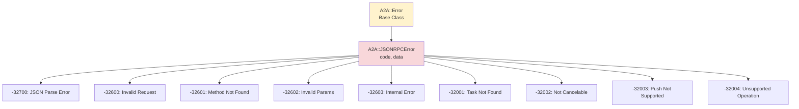
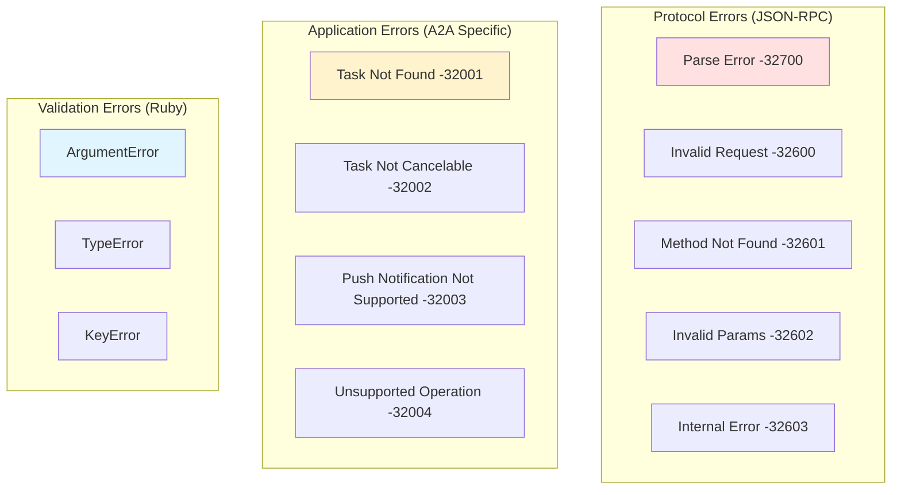
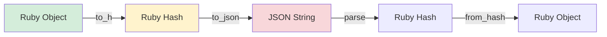

# A2A Ruby Gem - Design Principles and Decisions

This document provides an in-depth exploration of the design principles, patterns, and architectural decisions that shape the A2A Ruby gem.

## Table of Contents

- [Core Design Principles](#core-design-principles)
- [Architectural Decisions](#architectural-decisions)
- [Design Patterns](#design-patterns)
- [Error Handling Strategy](#error-handling-strategy)
- [Type System and Validation](#type-system-and-validation)
- [Serialization and Deserialization](#serialization-and-deserialization)
- [Extensibility Points](#extensibility-points)
- [Performance Considerations](#performance-considerations)
- [Testing Strategy](#testing-strategy)
- [Future Design Considerations](#future-design-considerations)

## Core Design Principles

### 1. Separation of Concerns

**Principle**: Each component should have a single, well-defined responsibility.

**Implementation**:
- Models handle data representation and validation
- Protocol layer manages JSON-RPC formatting
- Client/Server layers define interfaces
- Business logic lives in user implementations

**Rationale**: This separation makes the codebase easier to understand, test, and modify. Changes to one layer don't cascade to others.



### 2. Protocol Compliance

**Principle**: Strictly adhere to the A2A protocol specification and JSON-RPC 2.0 standard.

**Implementation**:
- All JSON serialization uses camelCase as per protocol spec
- Error codes match JSON-RPC and A2A specifications exactly
- Request/Response structures follow JSON-RPC 2.0 format
- Models map directly to protocol JSON schemas

**Rationale**: Ensures interoperability with any A2A-compliant implementation, regardless of language or framework.

### 3. Testability

**Principle**: Every component should be independently testable in isolation.

**Implementation**:
- Pure data models with no side effects
- Dependency injection for collaborators
- Clear interfaces defined by base classes
- Factory methods that can be mocked

**Rationale**: Isolated testing leads to faster test suites, better coverage, and easier debugging.

### 4. Extensibility

**Principle**: The gem should be easy to extend without modifying existing code.

**Implementation**:
- Abstract base classes for Client and Server
- Factory pattern for polymorphic types
- Open/Closed principle: open for extension, closed for modification
- Hook methods for customization

**Rationale**: Allows users to build on the gem without forking or monkey-patching.

### 5. Type Safety

**Principle**: Leverage Ruby's type system and RBS for reliability.

**Implementation**:
- Value objects for domain concepts (TaskState, FileContent)
- Immutable models where appropriate
- RBS type signatures for all public APIs
- Validation at object construction time

**Rationale**: Catches errors early and provides better IDE support and documentation.

## Architectural Decisions

### ADR-001: Layered Architecture Over Flat Structure

**Context**: Need to organize code for a protocol implementation with multiple concerns.

**Decision**: Use a four-layer architecture (Models, Protocol, Interface, Application).

**Consequences**:
- **Positive**: Clear separation of concerns, easier navigation, better testability
- **Negative**: More files and directories, steeper learning curve for simple use cases
- **Mitigation**: Comprehensive documentation and examples

### ADR-002: Immutable Value Objects for States

**Context**: Task states need to be tracked and compared throughout the lifecycle.

**Decision**: Implement TaskState as an immutable value object.

```ruby
class TaskState
  STATES = %w[submitted working input-required completed canceled failed unknown].freeze

  attr_reader :value

  def initialize(value)
    @value = validate_state(value)
  end

  # Predicate methods for each state
  def submitted?
    @value == 'submitted'
  end

  def terminal?
    completed? || canceled? || failed?
  end
end
```

**Consequences**:
- **Positive**: Thread-safe, easier to reason about, explicit state transitions
- **Negative**: Must create new objects for state changes
- **Mitigation**: State objects are lightweight and creation is fast

### ADR-003: Factory Pattern for Polymorphic Parts

**Context**: Messages and Artifacts contain Parts that can be Text, File, or Data types.

**Decision**: Use Factory pattern in Part.from_hash() to instantiate correct subclass.

```ruby
class Part
  def self.from_hash(hash)
    case hash[:type]
    when 'text' then TextPart.from_hash(hash)
    when 'file' then FilePart.from_hash(hash)
    when 'data' then DataPart.from_hash(hash)
    else raise ArgumentError, "Unknown part type: #{hash[:type]}"
    end
  end
end
```

**Consequences**:
- **Positive**: Type-safe polymorphism, single deserialization entry point
- **Negative**: Must update factory when adding new part types
- **Mitigation**: Comprehensive tests ensure all types are handled

### ADR-004: Abstract Base Classes for Client/Server

**Context**: Users need to implement A2A clients and servers with custom transport.

**Decision**: Provide abstract base classes that raise NotImplementedError.

```ruby
class Client::Base
  def send_task(task_id:, message:, session_id: nil)
    raise NotImplementedError, "Subclasses must implement #send_task"
  end
end
```

**Consequences**:
- **Positive**: Clear contract, documentation through code, enforces implementation
- **Negative**: Requires subclassing, more verbose than modules
- **Mitigation**: Provide comprehensive examples and documentation

### ADR-005: Dual Serialization Format Support

**Context**: Need to support both Ruby hash and JSON string formats.

**Decision**: Implement both to_h/from_hash and to_json methods.

```ruby
class Task
  def to_h
    { id: id, status: status.to_h }.compact
  end

  def to_json(*args)
    to_h.to_json(*args)
  end

  def self.from_hash(hash)
    # Support both symbol and string keys
    new(id: hash[:id] || hash['id'])
  end
end
```

**Consequences**:
- **Positive**: Flexible for different use cases, works with JSON libraries
- **Negative**: More code to maintain
- **Mitigation**: Consistent pattern across all models

### ADR-006: Comprehensive Error Hierarchy

**Context**: Need to handle both protocol-level and application-level errors.

**Decision**: Create error hierarchy matching JSON-RPC and A2A specifications.



**Consequences**:
- **Positive**: Specific error handling, matches protocol exactly
- **Negative**: Many error classes to maintain
- **Mitigation**: Code generation or metaprogramming could reduce duplication

## Design Patterns

### 1. Factory Pattern

**Usage**: Creating polymorphic Part objects from JSON.

**Benefits**:
- Single entry point for deserialization
- Type-safe object creation
- Easy to extend with new types

**Example**:
```ruby
# Automatically creates the right Part subclass
part = Part.from_hash({ type: 'text', text: 'Hello' })
# => #<A2A::Models::TextPart>
```

### 2. Builder Pattern (Convenience Methods)

**Usage**: Simplifying common object creation scenarios.

**Benefits**:
- Reduces boilerplate
- Makes common cases easy
- Still allows full customization

**Example**:
```ruby
# Simple text message
msg = Message.text(role: 'user', text: 'Hello')

# Equivalent to:
msg = Message.new(
  role: 'user',
  parts: [TextPart.new(text: 'Hello')]
)
```

### 3. Template Method Pattern

**Usage**: Defining algorithm structure in base classes.

**Benefits**:
- Enforces interface contract
- Allows customization at specific points
- Documents expected behavior

**Example**:
```ruby
class Server::Base
  def handle_request(request)
    # Template method defines the flow
    parse_request(request)
    route_to_handler(request)
    create_response(result)
  rescue => e
    create_error_response(e)
  end

  # Subclasses implement specific handlers
  def handle_send_task(params)
    raise NotImplementedError
  end
end
```

### 4. Value Object Pattern

**Usage**: Representing domain concepts as immutable values.

**Benefits**:
- Thread-safe
- Easier to reason about
- Can be used as hash keys

**Example**:
```ruby
state1 = TaskState.new('completed')
state2 = TaskState.new('completed')

state1 == state2  # => true
state1.completed? # => true
state1.terminal?  # => true
```

### 5. Data Mapper Pattern

**Usage**: Converting between domain objects and persistence format (JSON).

**Benefits**:
- Separates domain logic from serialization
- Supports different formats (hash, JSON)
- Easy to test

**Example**:
```ruby
# Domain object -> Hash
task.to_h
# => { id: '123', status: { state: 'completed' } }

# Hash -> Domain object
Task.from_hash({ id: '123', status: { state: 'completed' } })
# => #<A2A::Models::Task>
```

## Error Handling Strategy

### Error Categories



### Error Handling Guidelines

1. **Validation Errors**: Raise immediately at construction time
2. **Protocol Errors**: Return as JSON-RPC error responses
3. **Application Errors**: Use specific A2A error classes
4. **Unknown Errors**: Wrap in InternalError with original message

## Type System and Validation

### Validation Strategy

**When to Validate**:
- At object construction (fail fast)
- Before serialization (ensure valid output)
- After deserialization (ensure valid input)

**What to Validate**:
- Required fields are present
- Enums match allowed values
- Data types are correct
- Business rules are satisfied

**Example**:
```ruby
class Message
  ROLES = %w[user agent].freeze

  def initialize(role:, parts:, metadata: nil)
    validate_role(role)
    validate_parts(parts)

    @role = role
    @parts = normalize_parts(parts)
    @metadata = metadata
  end

  private

  def validate_role(role)
    unless ROLES.include?(role)
      raise ArgumentError, "Invalid role: #{role}"
    end
  end

  def validate_parts(parts)
    raise ArgumentError, "Parts cannot be empty" if parts.empty?
  end
end
```

### RBS Type Signatures

The gem uses RBS for type definitions:

```ruby
# sig/a2a/models/task.rbs
module A2A
  module Models
    class Task
      attr_reader id: String
      attr_reader session_id: String?
      attr_reader status: TaskStatus
      attr_reader artifacts: Array[Artifact]?

      def initialize: (
        id: String,
        status: TaskStatus | Hash[Symbol, untyped],
        ?session_id: String?,
        ?artifacts: Array[Artifact]?,
        ?metadata: Hash[Symbol, untyped]?
      ) -> void

      def state: () -> TaskState
      def to_h: () -> Hash[Symbol, untyped]
    end
  end
end
```

## Serialization and Deserialization

### Serialization Strategy



### Key Naming Convention

**Ruby**: Use snake_case for internal representation
**JSON**: Use camelCase for protocol compliance

```ruby
def to_h
  {
    sessionId: session_id,        # snake_case -> camelCase
    taskId: task_id,
    documentationUrl: documentation_url
  }.compact
end

def self.from_hash(hash)
  new(
    session_id: hash[:sessionId] || hash['sessionId'] || hash[:session_id],
    task_id: hash[:taskId] || hash['taskId'] || hash[:task_id]
  )
end
```

### Compact Hash Strategy

Use `.compact` to remove nil values, making JSON cleaner:

```ruby
def to_h
  {
    id: id,
    sessionId: session_id,    # nil values removed
    metadata: metadata         # nil values removed
  }.compact
end
```

## Extensibility Points

### 1. Adding New Part Types

To add a new part type (e.g., VideoPart):

```ruby
# 1. Create the part class
class VideoPart < Part
  attr_reader :video_url, :duration

  def initialize(video_url:, duration: nil, metadata: nil)
    super(metadata: metadata)
    @video_url = video_url
    @duration = duration
  end

  def type
    'video'
  end

  def to_h
    super.merge(videoUrl: video_url, duration: duration)
  end

  def self.from_hash(hash)
    new(
      video_url: hash[:videoUrl] || hash['videoUrl'],
      duration: hash[:duration] || hash['duration'],
      metadata: hash[:metadata] || hash['metadata']
    )
  end
end

# 2. Update the factory
class Part
  def self.from_hash(hash)
    case hash[:type]
    when 'text' then TextPart.from_hash(hash)
    when 'file' then FilePart.from_hash(hash)
    when 'data' then DataPart.from_hash(hash)
    when 'video' then VideoPart.from_hash(hash)  # Add new type
    end
  end
end
```

### 2. Implementing Custom Clients

```ruby
class HttpClient < A2A::Client::Base
  def initialize(agent_url)
    super(agent_url)
    @http_client = Net::HTTP
  end

  def discover
    response = @http_client.get("#{agent_url}/.well-known/agent.json")
    @agent_card = AgentCard.from_hash(JSON.parse(response.body))
  end

  def send_task(task_id:, message:, session_id: nil)
    request = Protocol::Request.new(
      method: 'tasks/send',
      params: { taskId: task_id, message: message.to_h },
      id: SecureRandom.uuid
    )

    response = @http_client.post(agent_url, request.to_json)
    # Parse and return Task
  end
end
```

### 3. Implementing Custom Servers

```ruby
class RackServer < A2A::Server::Base
  def call(env)
    request_body = env['rack.input'].read
    request = JSON.parse(request_body)

    response = handle_request(request)

    [200, { 'Content-Type' => 'application/json' }, [response.to_json]]
  end

  def handle_request(request)
    case request['method']
    when 'tasks/send'
      result = handle_send_task(request['params'])
      Protocol::Response.success(id: request['id'], result: result)
    else
      Protocol::Response.error(
        id: request['id'],
        error: { code: -32601, message: 'Method not found' }
      )
    end
  end
end
```

## Performance Considerations

### Object Allocation

**Strategy**: Minimize object creation in hot paths.

**Implementation**:
- Reuse frozen constants for enums
- Use compact for conditional hash keys
- Lazy load dependencies

```ruby
# Good: Reuse frozen constant
STATES = %w[submitted working completed].freeze

# Good: Compact removes nils without extra allocations
{ id: id, sessionId: session_id }.compact

# Avoid: Creating new arrays unnecessarily
# Bad: parts.map { |p| p.to_h }.select { |h| h.present? }
# Good: parts.map(&:to_h).compact
```

### JSON Serialization

**Strategy**: Let the JSON library handle serialization efficiently.

**Implementation**:
- Provide to_h that returns primitive types
- Let JSON.generate handle the serialization
- Avoid custom JSON encoding unless necessary

### Memory Efficiency

**Strategy**: Use value objects and immutability to enable sharing.

**Implementation**:
- Immutable TaskState instances can be shared
- Frozen string literals reduce duplication
- Compact hashes avoid storing nil values

## Testing Strategy

### Unit Tests

Test each component in isolation:

```ruby
RSpec.describe A2A::Models::Task do
  describe '#state' do
    it 'returns the task state from status' do
      task = described_class.new(
        id: 'task-1',
        status: { state: 'completed' }
      )

      expect(task.state).to be_completed
    end
  end
end
```

### Integration Tests

Test interactions between components:

```ruby
RSpec.describe 'Task serialization' do
  it 'round-trips through JSON' do
    original = A2A::Models::Task.new(
      id: 'task-1',
      status: { state: 'working' }
    )

    json = original.to_json
    restored = A2A::Models::Task.from_hash(JSON.parse(json))

    expect(restored.id).to eq(original.id)
    expect(restored.state).to eq(original.state)
  end
end
```

### Contract Tests

Verify protocol compliance:

```ruby
RSpec.describe 'A2A Protocol Compliance' do
  it 'matches JSON schema for Task' do
    task = create_task
    schema = load_schema('task.json')

    expect(task.to_h).to match_json_schema(schema)
  end
end
```

## Future Design Considerations

### 1. JSON Schema Validation

**Goal**: Validate all protocol messages against official schemas.

**Approach**:
- Load schemas from protocol_specification/json/
- Validate on serialization and deserialization
- Provide helpful error messages on validation failure

### 2. Streaming Support

**Goal**: Implement Server-Sent Events (SSE) for real-time updates.

**Approach**:
- Add SSE event classes to protocol/events/
- Implement streaming in client and server base classes
- Handle connection lifecycle and reconnection

### 3. Webhook Support

**Goal**: Enable push notifications for task updates.

**Approach**:
- Add webhook configuration to server
- Implement retry logic for failed deliveries
- Support webhook authentication

### 4. Logging and Observability

**Goal**: Comprehensive logging for debugging and monitoring.

**Approach**:
- Add structured logging throughout
- Support custom loggers
- Include request/response IDs for tracing

### 5. Connection Pooling

**Goal**: Efficient HTTP client connection management.

**Approach**:
- Support connection pooling in HTTP client
- Configure timeouts and retry policies
- Handle connection failures gracefully

## Related Documentation

- [Architecture Overview](index.md) - High-level architecture and components
- [Protocol Flow and Sequences](flow.md) - Detailed interaction diagrams
- [Gem Architecture](gem-architecture.md) - Gem architecture document

---

[Back to Documentation Home](../index.md)
