# A2A Ruby Gem - Protocol Flow and Sequence Diagrams

This document provides detailed sequence diagrams and flow charts illustrating how the A2A protocol operates in various scenarios.

## Table of Contents

- [Protocol Overview](#protocol-overview)
- [Discovery Flow](#discovery-flow)
- [Task Lifecycle](#task-lifecycle)
- [Synchronous Task Flow](#synchronous-task-flow)
- [Streaming Task Flow](#streaming-task-flow)
- [Multi-Turn Conversation Flow](#multi-turn-conversation-flow)
- [Error Handling Flows](#error-handling-flows)
- [Push Notification Flow](#push-notification-flow)
- [Task Cancellation Flow](#task-cancellation-flow)
- [State Transitions](#state-transitions)
- [Component Interactions](#component-interactions)

## Protocol Overview

The A2A protocol is built on JSON-RPC 2.0 and uses HTTP as the transport layer. The protocol defines several methods for task management and communication between clients and agents.

### Core Protocol Methods

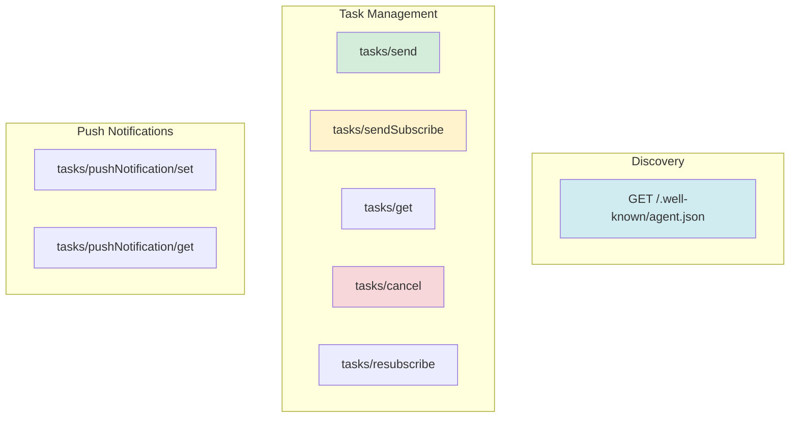
```mermaid
graph TD
    subgraph "Discovery"
        D[GET /.well-known/agent.json]
    end

    subgraph "Task Management"
        TS[tasks/send]
        TSS[tasks/sendSubscribe]
        TG[tasks/get]
        TC[tasks/cancel]
        TR[tasks/resubscribe]
    end

    subgraph "Push Notifications"
        PNS[tasks/pushNotification/set]
        PNG[tasks/pushNotification/get]
    end

    style D fill:#d1ecf1
    style TS fill:#d4edda
    style TSS fill:#fff3cd
    style TC fill:#f8d7da
```

## Discovery Flow

Before a client can interact with an agent, it must discover the agent's capabilities through the AgentCard.

### Agent Discovery Sequence

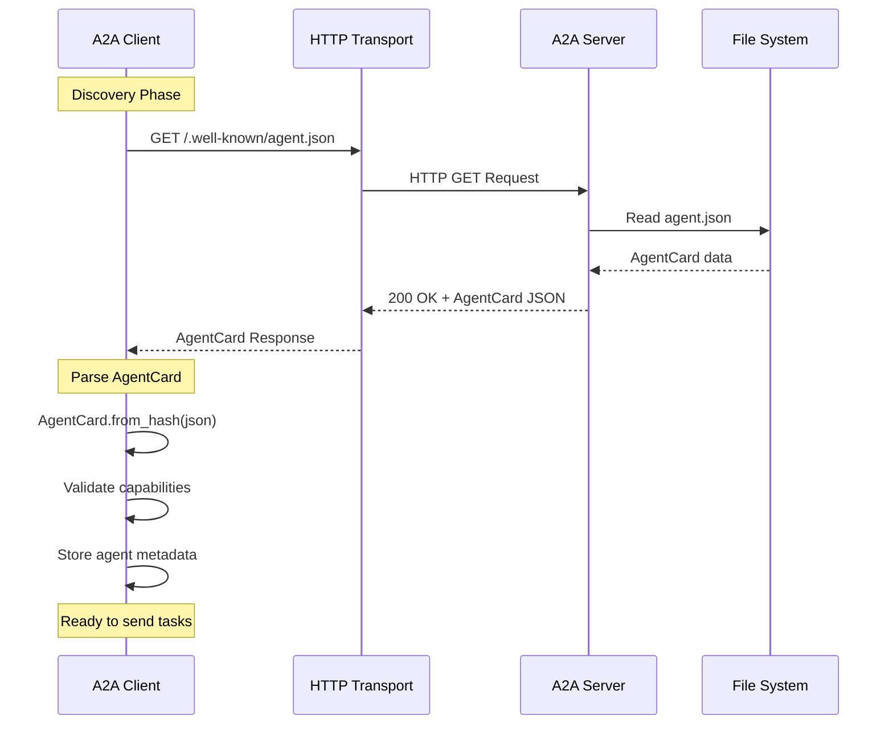
```mermaid
sequenceDiagram
    participant Client as A2A Client
    participant HTTP as HTTP Transport
    participant Server as A2A Server
    participant FS as File System

    Note over Client: Discovery Phase
    Client->>HTTP: GET /.well-known/agent.json
    HTTP->>Server: HTTP GET Request

    Server->>FS: Read agent.json
    FS-->>Server: AgentCard data

    Server-->>HTTP: 200 OK + AgentCard JSON
    HTTP-->>Client: AgentCard Response

    Note over Client: Parse AgentCard
    Client->>Client: AgentCard.from_hash(json)
    Client->>Client: Validate capabilities
    Client->>Client: Store agent metadata

    Note over Client: Ready to send tasks
```

### Discovery Implementation Flow

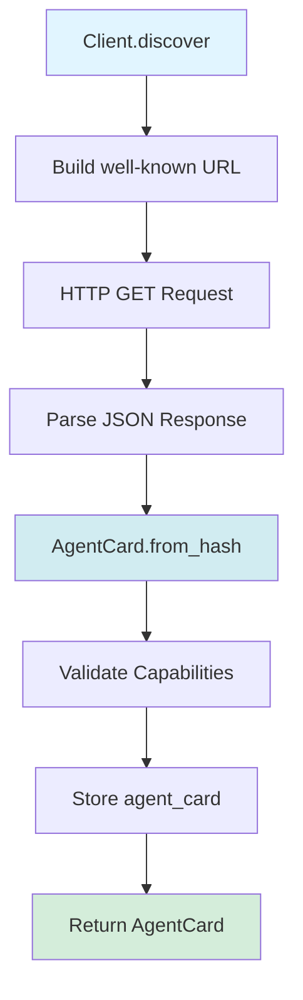
```mermaid
graph TD
    Start[Client.discover] --> BuildURL[Build well-known URL]
    BuildURL --> HTTPGet[HTTP GET Request]
    HTTPGet --> ParseJSON[Parse JSON Response]
    ParseJSON --> CreateCard[AgentCard.from_hash]
    CreateCard --> ValidateCap[Validate Capabilities]
    ValidateCap --> StoreCard[Store agent_card]
    StoreCard --> End[Return AgentCard]

    style Start fill:#e1f5ff
    style CreateCard fill:#d1ecf1
    style End fill:#d4edda
```

## Task Lifecycle

Tasks progress through a series of states from submission to completion.

### Task State Machine

```mermaid
stateDiagram-v2
    [*] --> submitted: Client sends task

    submitted --> working: Agent starts processing
    submitted --> failed: Validation error
    submitted --> canceled: Client cancels

    working --> input-required: Agent needs more info
    working --> completed: Processing successful
    working --> failed: Processing error
    working --> canceled: Client cancels

    input-required --> working: Client provides input
    input-required --> canceled: Client cancels
    input-required --> failed: Timeout/error

    completed --> [*]: Terminal state
    failed --> [*]: Terminal state
    canceled --> [*]: Terminal state
    unknown --> [*]: Terminal state

    note right of completed
        Terminal States:
        - completed
        - failed
        - canceled
    end note
```

### Task Lifecycle Sequence

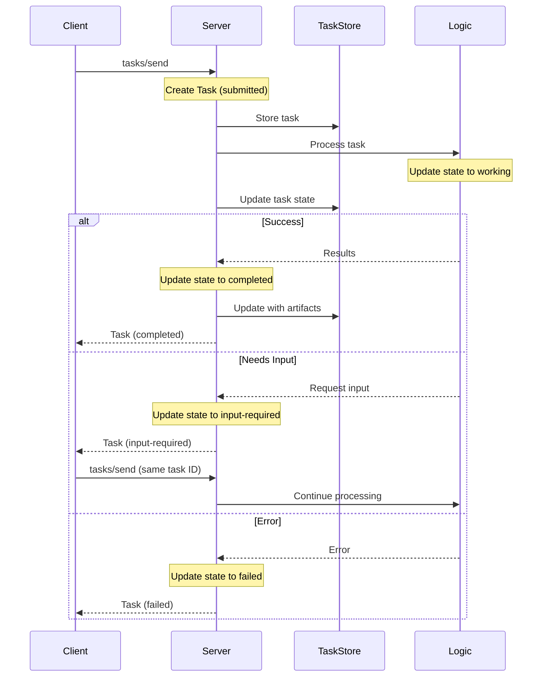
```mermaid
sequenceDiagram
    participant Client
    participant Server
    participant TaskStore
    participant Logic

    Client->>Server: tasks/send
    Note over Server: Create Task (submitted)
    Server->>TaskStore: Store task

    Server->>Logic: Process task
    Note over Logic: Update state to working
    Server->>TaskStore: Update task state

    alt Success
        Logic-->>Server: Results
        Note over Server: Update state to completed
        Server->>TaskStore: Update with artifacts
        Server-->>Client: Task (completed)
    else Needs Input
        Logic-->>Server: Request input
        Note over Server: Update state to input-required
        Server-->>Client: Task (input-required)
        Client->>Server: tasks/send (same task ID)
        Server->>Logic: Continue processing
    else Error
        Logic-->>Server: Error
        Note over Server: Update state to failed
        Server-->>Client: Task (failed)
    end
```

## Synchronous Task Flow

The simplest interaction pattern where the client sends a task and waits for completion.

### Synchronous tasks/send Sequence

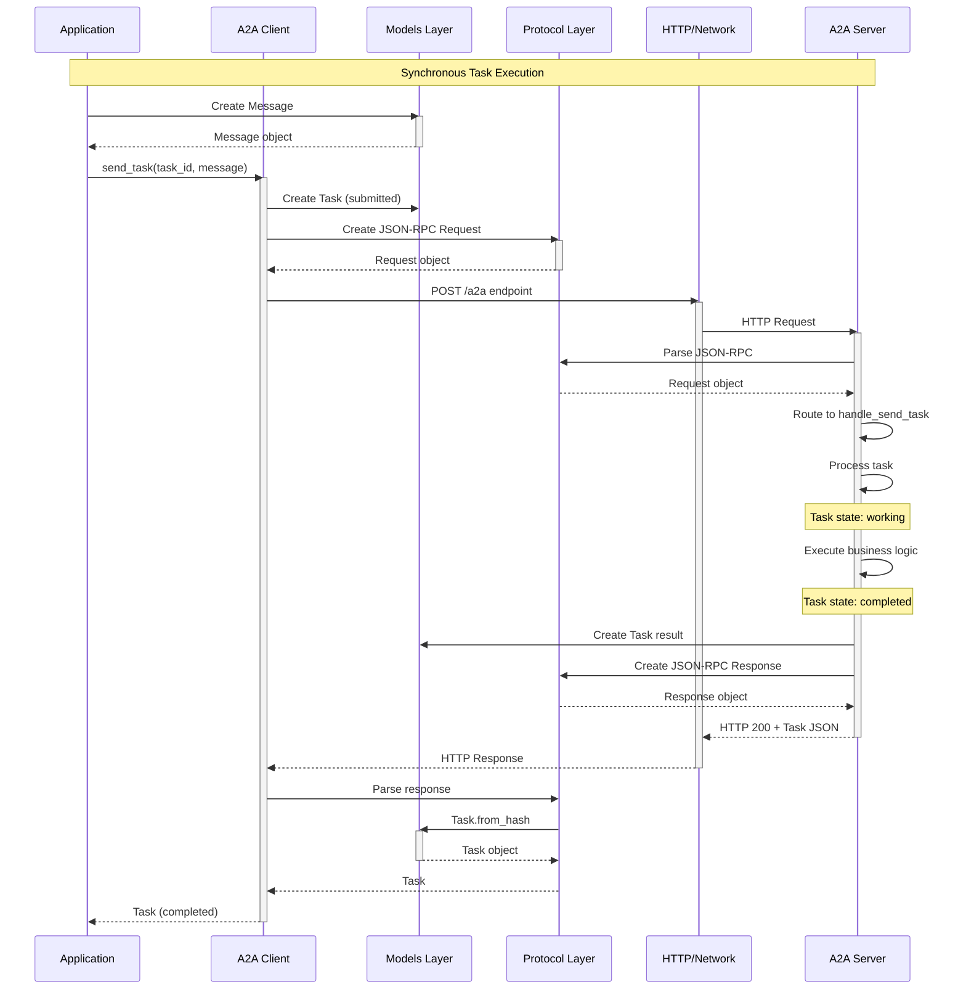
```mermaid
sequenceDiagram
    participant App as Application
    participant Client as A2A Client
    participant Models as Models Layer
    participant Protocol as Protocol Layer
    participant Network as HTTP/Network
    participant Server as A2A Server

    Note over App,Server: Synchronous Task Execution

    App->>Models: Create Message
    activate Models
    Models-->>App: Message object
    deactivate Models

    App->>Client: send_task(task_id, message)
    activate Client

    Client->>Models: Create Task (submitted)
    Client->>Protocol: Create JSON-RPC Request
    activate Protocol
    Protocol-->>Client: Request object
    deactivate Protocol

    Client->>Network: POST /a2a endpoint
    activate Network
    Network->>Server: HTTP Request
    activate Server

    Server->>Protocol: Parse JSON-RPC
    Protocol-->>Server: Request object

    Server->>Server: Route to handle_send_task
    Server->>Server: Process task
    Note over Server: Task state: working

    Server->>Server: Execute business logic
    Note over Server: Task state: completed

    Server->>Models: Create Task result
    Server->>Protocol: Create JSON-RPC Response
    Protocol-->>Server: Response object

    Server-->>Network: HTTP 200 + Task JSON
    deactivate Server
    Network-->>Client: HTTP Response
    deactivate Network

    Client->>Protocol: Parse response
    Protocol->>Models: Task.from_hash
    activate Models
    Models-->>Protocol: Task object
    deactivate Models
    Protocol-->>Client: Task

    Client-->>App: Task (completed)
    deactivate Client
```

### Synchronous Flow with Error

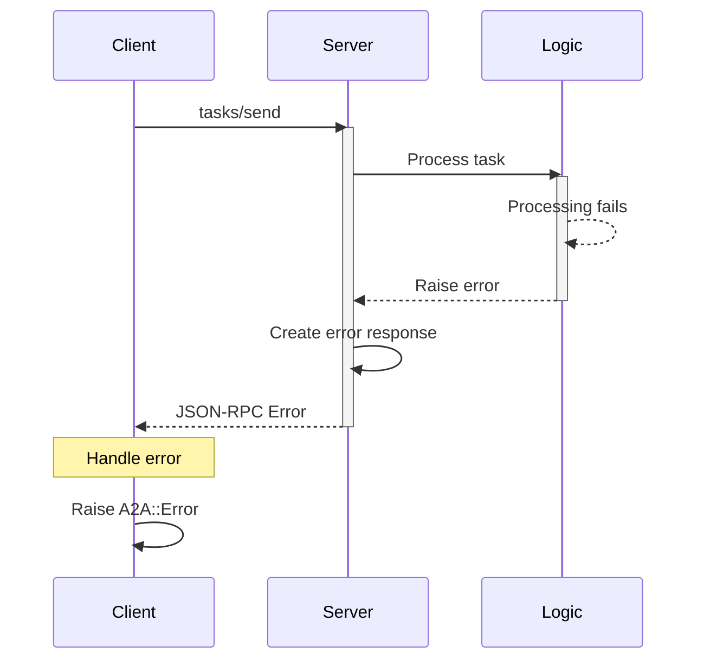
```mermaid
sequenceDiagram
    participant Client
    participant Server
    participant Logic

    Client->>Server: tasks/send
    activate Server
    Server->>Logic: Process task
    activate Logic

    Logic-->>Logic: Processing fails
    Logic-->>Server: Raise error
    deactivate Logic

    Server->>Server: Create error response
    Server-->>Client: JSON-RPC Error
    deactivate Server

    Note over Client: Handle error
    Client->>Client: Raise A2A::Error
```

## Streaming Task Flow

For long-running tasks, streaming provides real-time updates via Server-Sent Events (SSE).

### Streaming tasks/sendSubscribe Sequence

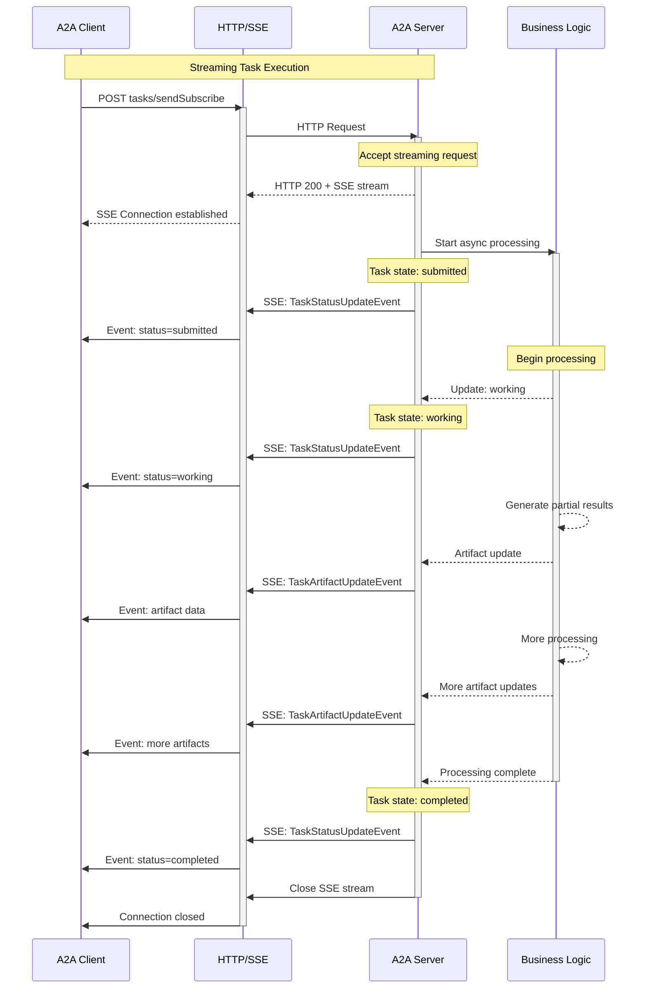
```mermaid
sequenceDiagram
    participant Client as A2A Client
    participant HTTP as HTTP/SSE
    participant Server as A2A Server
    participant Logic as Business Logic

    Note over Client,Server: Streaming Task Execution

    Client->>HTTP: POST tasks/sendSubscribe
    activate HTTP
    HTTP->>Server: HTTP Request
    activate Server

    Note over Server: Accept streaming request
    Server-->>HTTP: HTTP 200 + SSE stream
    HTTP-->>Client: SSE Connection established

    Server->>Logic: Start async processing
    activate Logic

    Note over Server: Task state: submitted
    Server->>HTTP: SSE: TaskStatusUpdateEvent
    HTTP->>Client: Event: status=submitted

    Note over Logic: Begin processing
    Logic-->>Server: Update: working
    Note over Server: Task state: working
    Server->>HTTP: SSE: TaskStatusUpdateEvent
    HTTP->>Client: Event: status=working

    Logic-->>Logic: Generate partial results
    Logic-->>Server: Artifact update
    Server->>HTTP: SSE: TaskArtifactUpdateEvent
    HTTP->>Client: Event: artifact data

    Logic-->>Logic: More processing
    Logic-->>Server: More artifact updates
    Server->>HTTP: SSE: TaskArtifactUpdateEvent
    HTTP->>Client: Event: more artifacts

    Logic-->>Server: Processing complete
    deactivate Logic
    Note over Server: Task state: completed
    Server->>HTTP: SSE: TaskStatusUpdateEvent
    HTTP->>Client: Event: status=completed

    Server->>HTTP: Close SSE stream
    deactivate Server
    HTTP->>Client: Connection closed
    deactivate HTTP
```

### SSE Event Structure

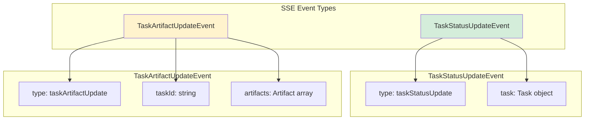
```mermaid
graph TD
    subgraph "SSE Event Types"
        TSU[TaskStatusUpdateEvent]
        TAU[TaskArtifactUpdateEvent]
    end

    subgraph "TaskStatusUpdateEvent"
        TSU_Type[type: taskStatusUpdate]
        TSU_Task[task: Task object]
    end

    subgraph "TaskArtifactUpdateEvent"
        TAU_Type[type: taskArtifactUpdate]
        TAU_TID[taskId: string]
        TAU_Artifacts[artifacts: Artifact array]
    end

    TSU --> TSU_Type
    TSU --> TSU_Task

    TAU --> TAU_Type
    TAU --> TAU_TID
    TAU --> TAU_Artifacts

    style TSU fill:#d4edda
    style TAU fill:#fff3cd
```

## Multi-Turn Conversation Flow

Sessions enable multi-turn conversations where context is maintained across multiple messages.

### Multi-Turn Conversation Sequence

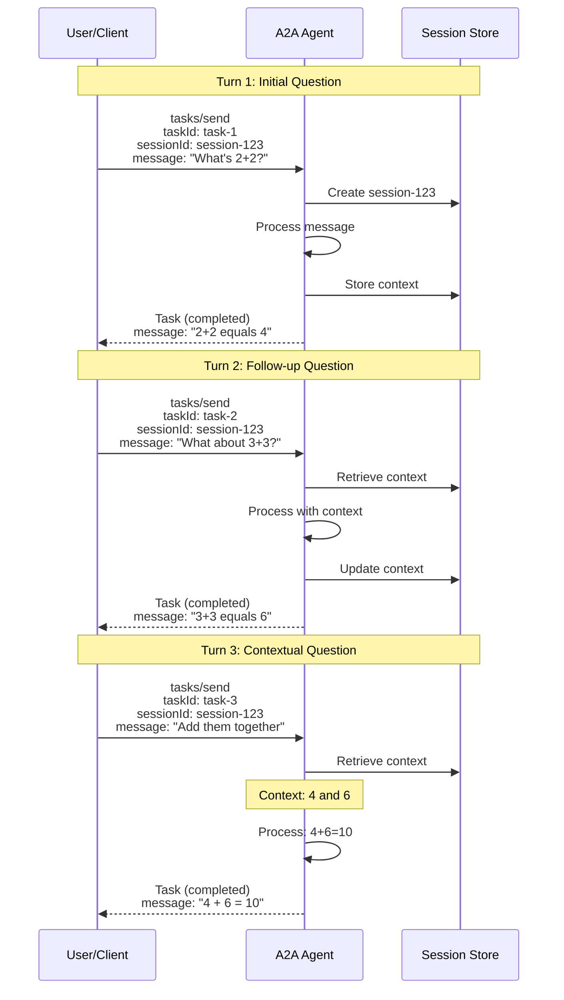
```mermaid
sequenceDiagram
    participant User as User/Client
    participant Agent as A2A Agent
    participant Session as Session Store

    Note over User,Session: Turn 1: Initial Question

    User->>Agent: tasks/send<br/>taskId: task-1<br/>sessionId: session-123<br/>message: "What's 2+2?"

    Agent->>Session: Create session-123
    Agent->>Agent: Process message
    Agent->>Session: Store context

    Agent-->>User: Task (completed)<br/>message: "2+2 equals 4"

    Note over User,Session: Turn 2: Follow-up Question

    User->>Agent: tasks/send<br/>taskId: task-2<br/>sessionId: session-123<br/>message: "What about 3+3?"

    Agent->>Session: Retrieve context
    Agent->>Agent: Process with context
    Agent->>Session: Update context

    Agent-->>User: Task (completed)<br/>message: "3+3 equals 6"

    Note over User,Session: Turn 3: Contextual Question

    User->>Agent: tasks/send<br/>taskId: task-3<br/>sessionId: session-123<br/>message: "Add them together"

    Agent->>Session: Retrieve context
    Note over Agent: Context: 4 and 6
    Agent->>Agent: Process: 4+6=10

    Agent-->>User: Task (completed)<br/>message: "4 + 6 = 10"
```

### Session Context Management

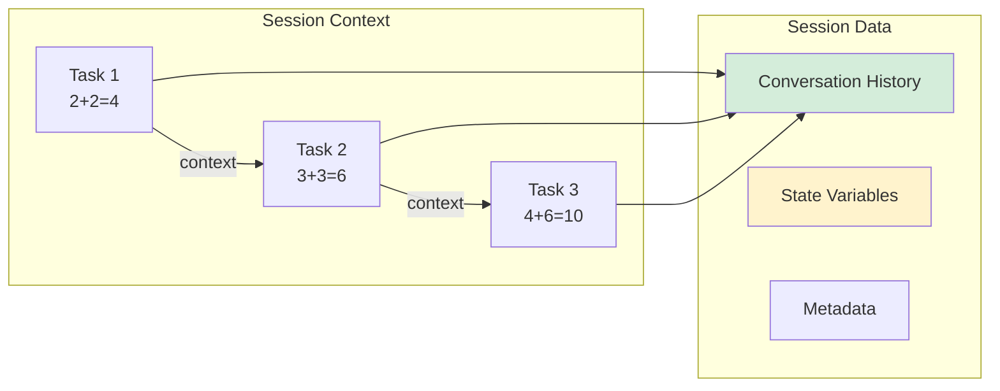
```mermaid
graph LR
    subgraph "Session Context"
        T1[Task 1<br/>2+2=4]
        T2[Task 2<br/>3+3=6]
        T3[Task 3<br/>4+6=10]

        T1 -->|context| T2
        T2 -->|context| T3
    end

    subgraph "Session Data"
        Conv[Conversation History]
        State[State Variables]
        Meta[Metadata]
    end

    T1 --> Conv
    T2 --> Conv
    T3 --> Conv

    style Conv fill:#d4edda
    style State fill:#fff3cd
```

## Error Handling Flows

### Protocol Error Flow

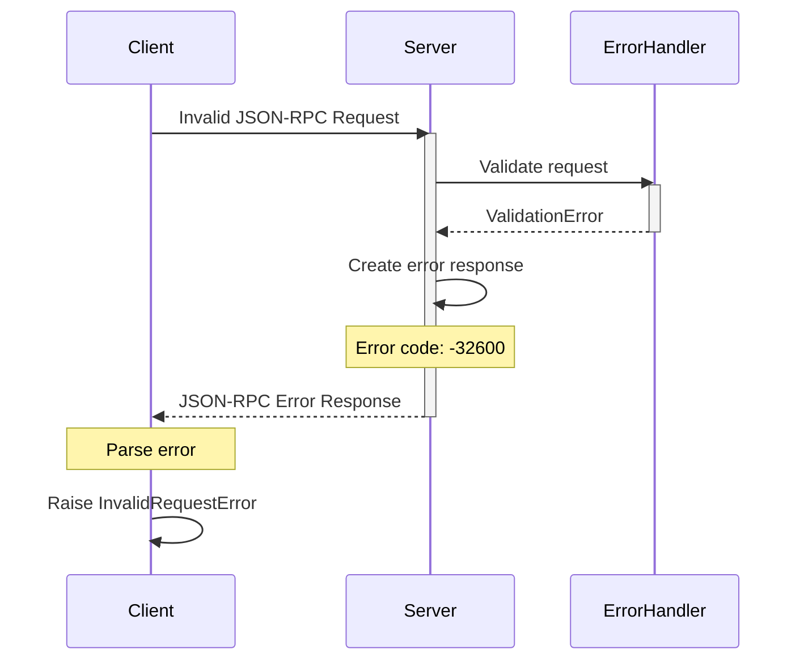
```mermaid
sequenceDiagram
    participant Client
    participant Server
    participant ErrorHandler

    Client->>Server: Invalid JSON-RPC Request
    activate Server

    Server->>ErrorHandler: Validate request
    activate ErrorHandler
    ErrorHandler-->>Server: ValidationError
    deactivate ErrorHandler

    Server->>Server: Create error response
    Note over Server: Error code: -32600

    Server-->>Client: JSON-RPC Error Response
    deactivate Server

    Note over Client: Parse error
    Client->>Client: Raise InvalidRequestError
```

### Application Error Flow

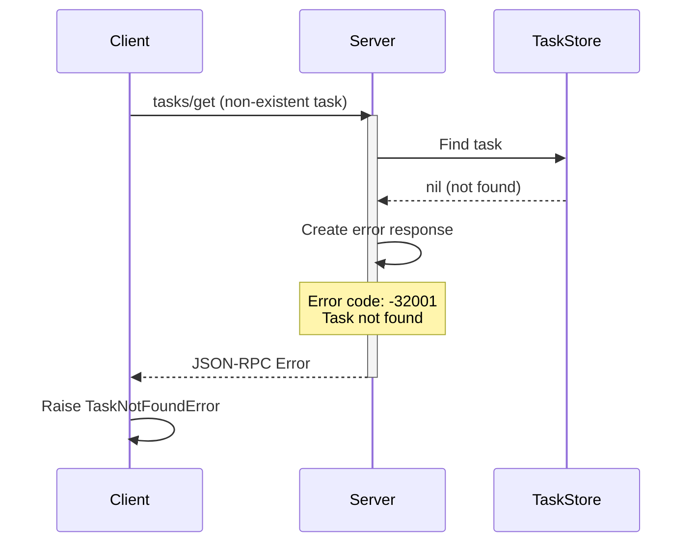
```mermaid
sequenceDiagram
    participant Client
    participant Server
    participant TaskStore

    Client->>Server: tasks/get (non-existent task)
    activate Server

    Server->>TaskStore: Find task
    TaskStore-->>Server: nil (not found)

    Server->>Server: Create error response
    Note over Server: Error code: -32001<br/>Task not found

    Server-->>Client: JSON-RPC Error
    deactivate Server

    Client->>Client: Raise TaskNotFoundError
```

### Error Response Structure

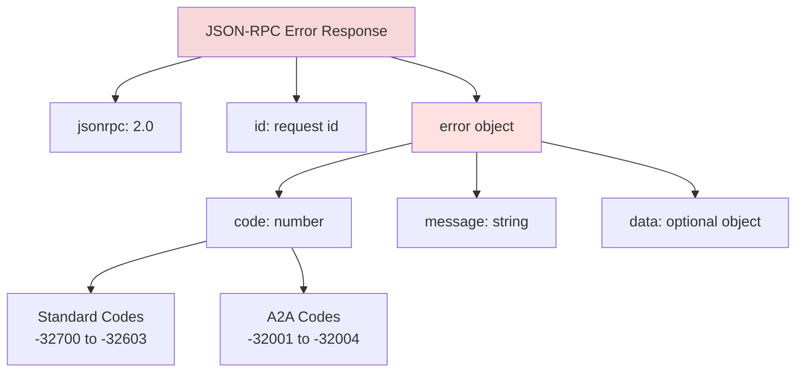
```mermaid
graph TD
    Error[JSON-RPC Error Response]

    Error --> JSONRPC[jsonrpc: 2.0]
    Error --> ID[id: request id]
    Error --> ErrorObj[error object]

    ErrorObj --> Code[code: number]
    ErrorObj --> Message[message: string]
    ErrorObj --> Data[data: optional object]

    Code --> StdCodes[Standard Codes<br/>-32700 to -32603]
    Code --> AppCodes[A2A Codes<br/>-32001 to -32004]

    style Error fill:#f8d7da
    style ErrorObj fill:#ffe1e1
```

## Push Notification Flow

Servers supporting push notifications can proactively send updates to clients via webhooks.

### Push Notification Setup and Delivery

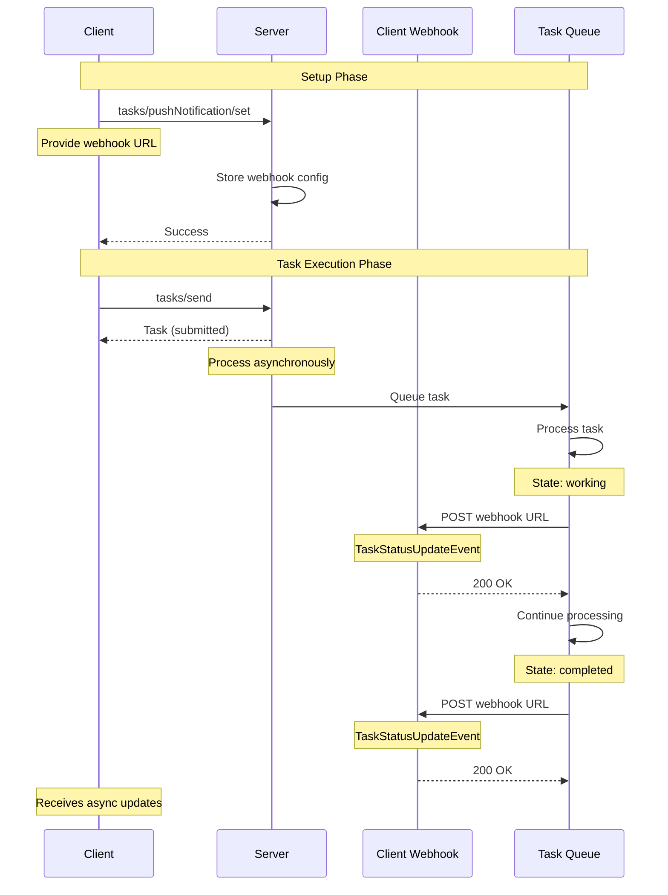
```mermaid
sequenceDiagram
    participant Client
    participant Server
    participant Webhook as Client Webhook
    participant Queue as Task Queue

    Note over Client,Queue: Setup Phase
    Client->>Server: tasks/pushNotification/set
    Note over Client: Provide webhook URL
    Server->>Server: Store webhook config
    Server-->>Client: Success

    Note over Client,Queue: Task Execution Phase
    Client->>Server: tasks/send
    Server-->>Client: Task (submitted)
    Note over Server: Process asynchronously

    Server->>Queue: Queue task
    Queue->>Queue: Process task

    Note over Queue: State: working
    Queue->>Webhook: POST webhook URL
    Note over Webhook: TaskStatusUpdateEvent
    Webhook-->>Queue: 200 OK

    Queue->>Queue: Continue processing

    Note over Queue: State: completed
    Queue->>Webhook: POST webhook URL
    Note over Webhook: TaskStatusUpdateEvent
    Webhook-->>Queue: 200 OK

    Note over Client: Receives async updates
```

### Webhook Retry Flow

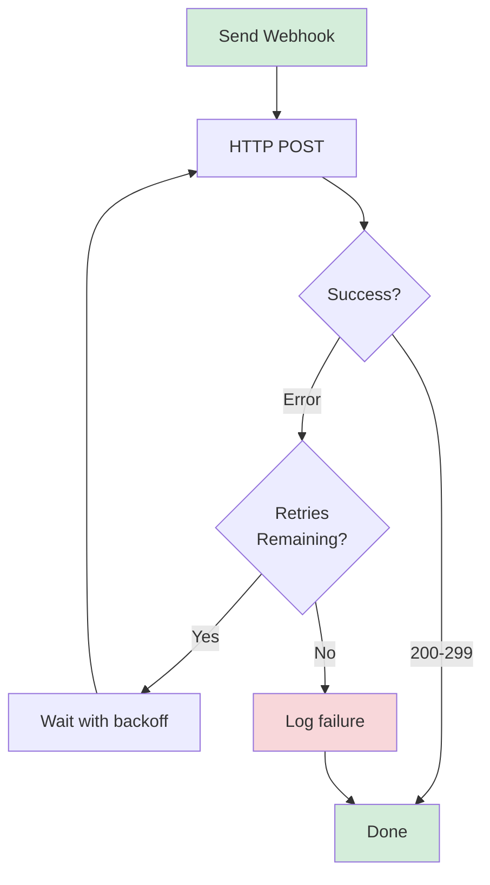
```mermaid
graph TD
    Send[Send Webhook] --> HTTP[HTTP POST]
    HTTP --> Success{Success?}

    Success -->|200-299| Done[Done]
    Success -->|Error| Retry{Retries<br/>Remaining?}

    Retry -->|Yes| Wait[Wait with backoff]
    Wait --> HTTP

    Retry -->|No| Log[Log failure]
    Log --> Done

    style Send fill:#d4edda
    style Done fill:#d4edda
    style Log fill:#f8d7da
```

## Task Cancellation Flow

Clients can request task cancellation for non-terminal tasks.

### Cancellation Sequence

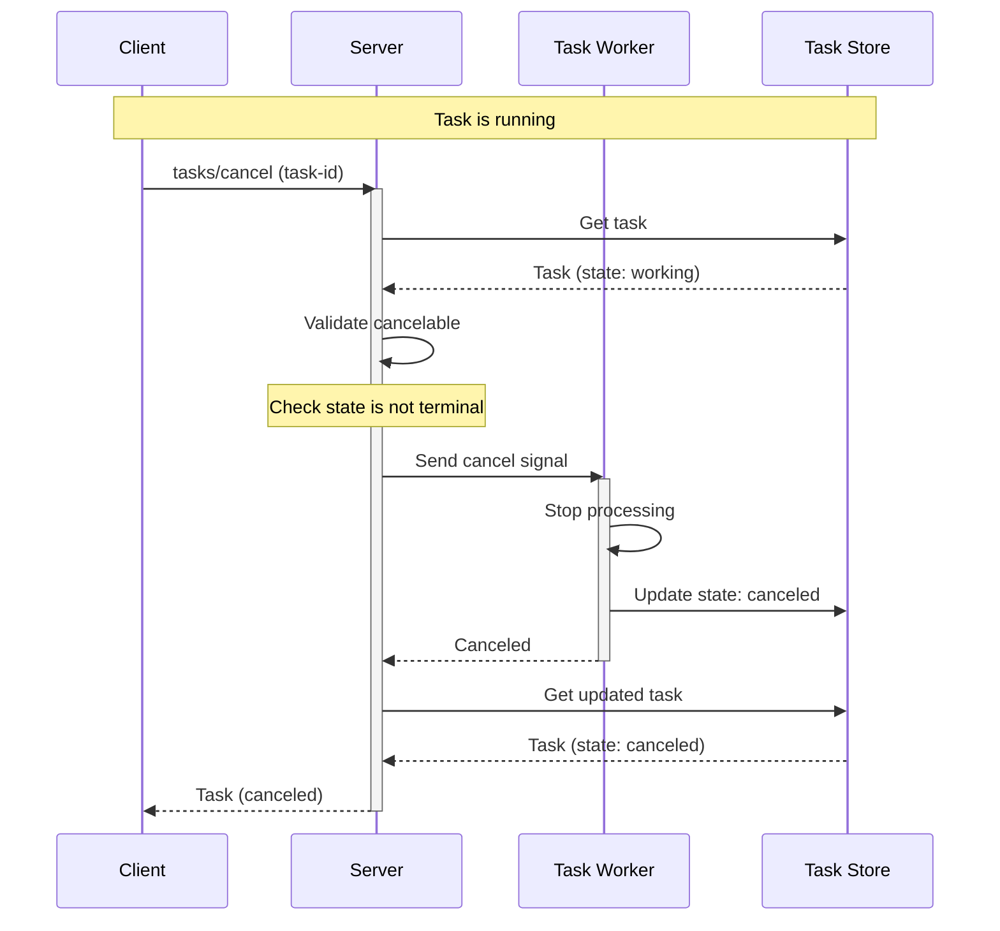
```mermaid
sequenceDiagram
    participant Client
    participant Server
    participant Worker as Task Worker
    participant Store as Task Store

    Note over Client,Store: Task is running

    Client->>Server: tasks/cancel (task-id)
    activate Server

    Server->>Store: Get task
    Store-->>Server: Task (state: working)

    Server->>Server: Validate cancelable
    Note over Server: Check state is not terminal

    Server->>Worker: Send cancel signal
    activate Worker
    Worker->>Worker: Stop processing
    Worker->>Store: Update state: canceled
    Worker-->>Server: Canceled
    deactivate Worker

    Server->>Store: Get updated task
    Store-->>Server: Task (state: canceled)

    Server-->>Client: Task (canceled)
    deactivate Server
```

### Cancellation Edge Cases

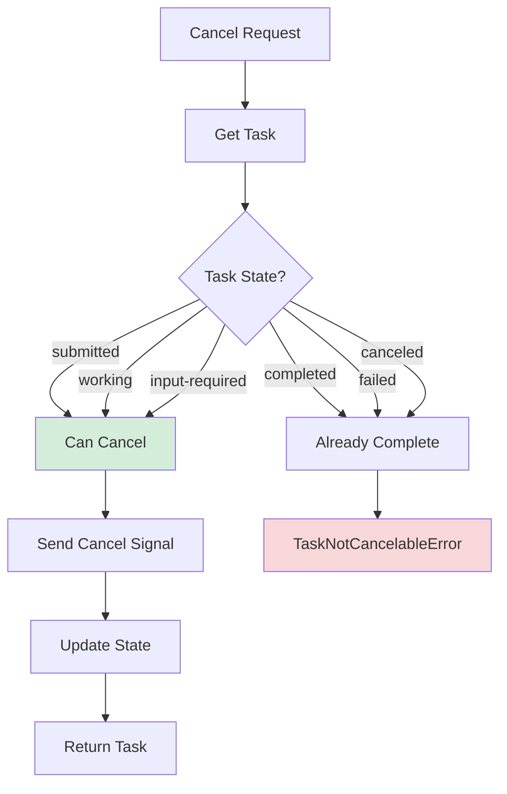
```mermaid
graph TD
    Cancel[Cancel Request] --> GetTask[Get Task]
    GetTask --> CheckState{Task State?}

    CheckState -->|submitted| CanCancel[Can Cancel]
    CheckState -->|working| CanCancel
    CheckState -->|input-required| CanCancel

    CheckState -->|completed| AlreadyDone[Already Complete]
    CheckState -->|failed| AlreadyDone
    CheckState -->|canceled| AlreadyDone

    CanCancel --> Signal[Send Cancel Signal]
    Signal --> Update[Update State]
    Update --> Return[Return Task]

    AlreadyDone --> Error[TaskNotCancelableError]

    style CanCancel fill:#d4edda
    style Error fill:#f8d7da
```

## State Transitions

### Valid State Transition Diagram

```mermaid
stateDiagram-v2
    direction LR

    [*] --> submitted

    submitted --> working: Agent starts
    submitted --> failed: Immediate error
    submitted --> canceled: Client cancels

    working --> input-required: Needs input
    working --> completed: Success
    working --> failed: Error
    working --> canceled: Client cancels

    input-required --> working: Input provided
    input-required --> failed: Timeout
    input-required --> canceled: Client cancels

    completed --> [*]
    failed --> [*]
    canceled --> [*]

    note right of submitted
        Initial state when
        task is created
    end note

    note right of working
        Agent is actively
        processing the task
    end note

    note right of input-required
        Agent needs more
        information from client
    end note

    note left of completed
        Terminal: Task
        completed successfully
    end note

    note left of failed
        Terminal: Task
        failed with error
    end note

    note left of canceled
        Terminal: Task
        was canceled
    end note
```

### State Transition Rules

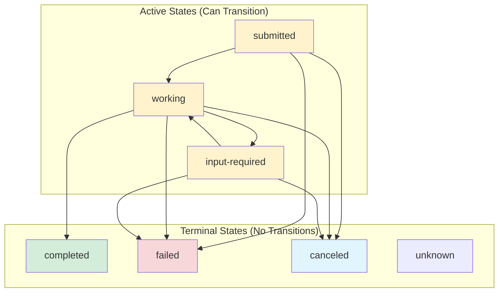
```mermaid
graph TD
    subgraph "Active States (Can Transition)"
        S[submitted]
        W[working]
        IR[input-required]
    end

    subgraph "Terminal States (No Transitions)"
        C[completed]
        F[failed]
        X[canceled]
        U[unknown]
    end

    S --> W
    S --> F
    S --> X

    W --> IR
    W --> C
    W --> F
    W --> X

    IR --> W
    IR --> F
    IR --> X

    style S fill:#fff3cd
    style W fill:#fff3cd
    style IR fill:#fff3cd
    style C fill:#d4edda
    style F fill:#f8d7da
    style X fill:#e1f5ff
```

## Component Interactions

### Complete Request/Response Flow

```mermaid
graph TB
    subgraph "Client Side"
        App[Application Code]
        ClientAPI[Client API]
        ReqBuilder[Request Builder]
        HTTPClient[HTTP Client]
    end

    subgraph "Network"
        Transport[HTTP/HTTPS]
    end

    subgraph "Server Side"
        HTTPServer[HTTP Server]
        Router[Request Router]
        Handler[Request Handler]
        Logic[Business Logic]
    end

    subgraph "Data Layer"
        Models[Domain Models]
        Protocol[JSON-RPC Protocol]
        TaskStore[Task Storage]
    end

    App --> ClientAPI
    ClientAPI --> ReqBuilder
    ReqBuilder --> Models
    ReqBuilder --> Protocol
    ReqBuilder --> HTTPClient

    HTTPClient --> Transport
    Transport --> HTTPServer

    HTTPServer --> Router
    Router --> Handler
    Handler --> Logic

    Logic --> Models
    Handler --> Models
    Handler --> Protocol
    Logic --> TaskStore

    Models -.response.-> Handler
    Protocol -.response.-> Handler
    Handler -.response.-> HTTPServer
    HTTPServer -.response.-> Transport
    Transport -.response.-> HTTPClient
    HTTPClient -.response.-> App

    style App fill:#e1f5ff
    style Logic fill:#fff3cd
    style Models fill:#d4edda
    style Protocol fill:#ffe1e1
```

### Model Interaction Flow

```mermaid
graph TD
    subgraph "Task Creation Flow"
        CreateTask[Create Task] --> CreateStatus[Create TaskStatus]
        CreateStatus --> CreateState[Create TaskState]
        CreateTask --> CreateMessage[Create Message]
        CreateMessage --> CreateParts[Create Parts]
        CreateParts --> TextPart[TextPart]
        CreateParts --> FilePart[FilePart]
        CreateParts --> DataPart[DataPart]
    end

    subgraph "Serialization Flow"
        ToHash[to_h] --> HashTask[Hash: Task]
        HashTask --> HashStatus[Hash: TaskStatus]
        HashStatus --> HashState[String: state]
        HashTask --> HashMessage[Hash: Message]
        HashMessage --> HashParts[Array: Parts]
    end

    subgraph "Deserialization Flow"
        FromHash[from_hash] --> ParseTask[Parse Task]
        ParseTask --> ParseStatus[TaskStatus.from_hash]
        ParseStatus --> ParseState[TaskState.new]
        ParseTask --> ParseMessage[Message.from_hash]
        ParseMessage --> ParseParts[Part.from_hash]
        ParseParts --> Factory[Factory Pattern]
        Factory --> CreateText[TextPart.from_hash]
        Factory --> CreateFile[FilePart.from_hash]
        Factory --> CreateData[DataPart.from_hash]
    end

    CreateTask -.serialize.-> ToHash
    FromHash -.deserialize.-> CreateTask

    style CreateTask fill:#d4edda
    style ToHash fill:#fff3cd
    style FromHash fill:#e1f5ff
```

## Protocol Method Summary

### All Protocol Methods

```mermaid
graph TB
    subgraph "Discovery"
        D1[GET /.well-known/agent.json<br/>Returns: AgentCard]
    end

    subgraph "Task Operations"
        T1[tasks/send<br/>Synchronous task execution]
        T2[tasks/sendSubscribe<br/>Streaming task execution]
        T3[tasks/get<br/>Get task status]
        T4[tasks/cancel<br/>Cancel running task]
        T5[tasks/resubscribe<br/>Resubscribe to streaming]
    end

    subgraph "Push Notifications"
        P1[tasks/pushNotification/set<br/>Configure webhook]
        P2[tasks/pushNotification/get<br/>Get webhook config]
    end

    style D1 fill:#d1ecf1
    style T1 fill:#d4edda
    style T2 fill:#fff3cd
    style T3 fill:#e1f5ff
    style T4 fill:#f8d7da
    style P1 fill:#ffe1e1
```

## Related Documentation

- [Architecture Overview](index.md) - High-level architecture and components
- [Design Principles](design.md) - Design patterns and decisions
- [Gem Architecture](gem-architecture.md) - Gem architecture document
- [Tasks Guide](../guides/tasks.md) - Working with tasks
- [Messages Guide](../guides/messages.md) - Working with messages

---

[Back to Documentation Home](../index.md)
