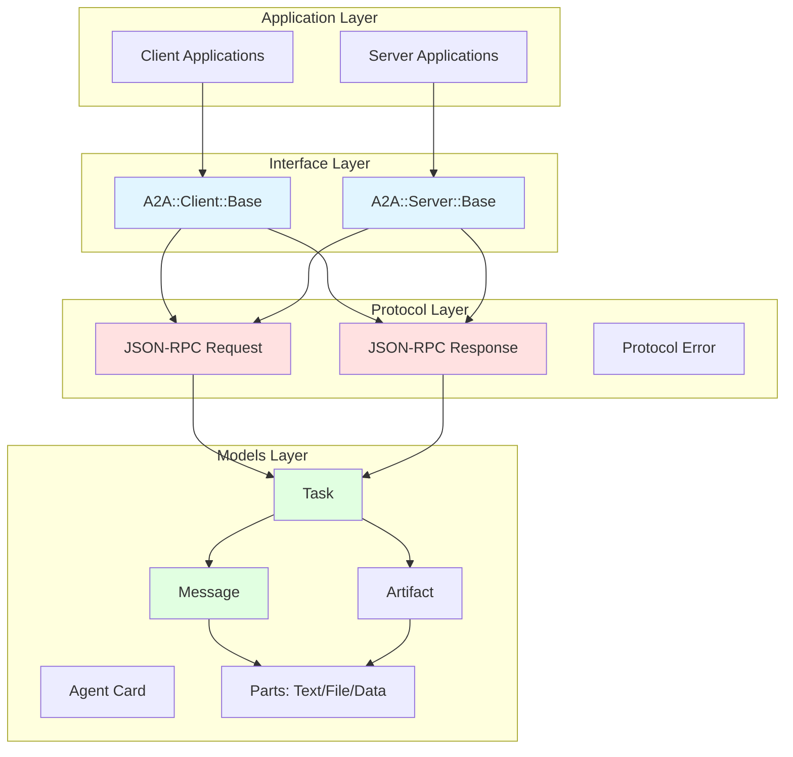
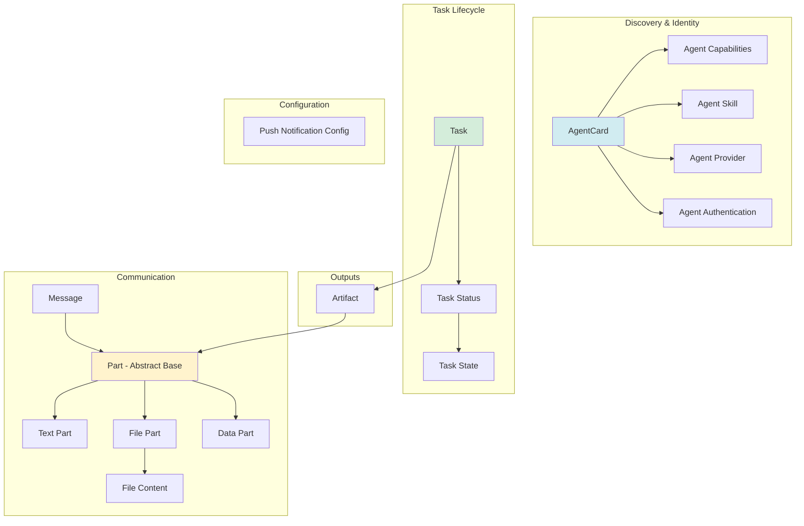
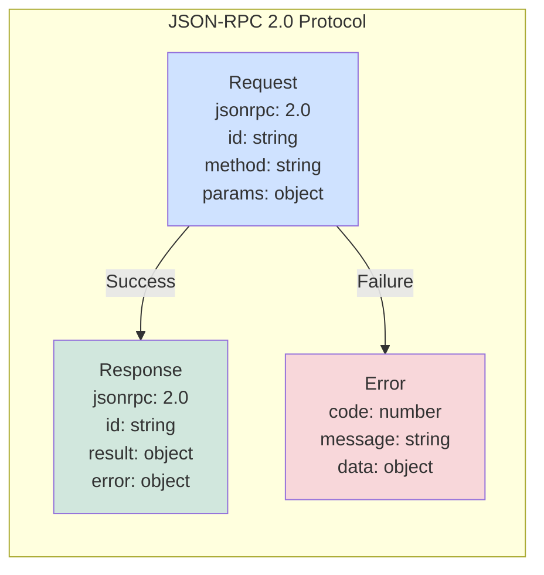
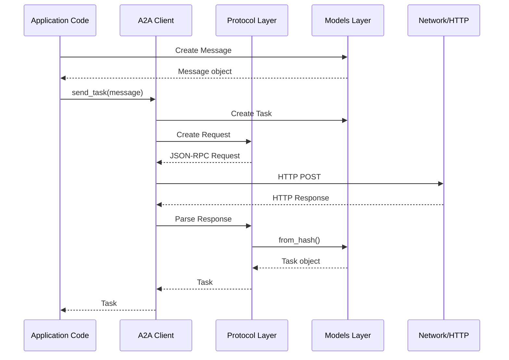
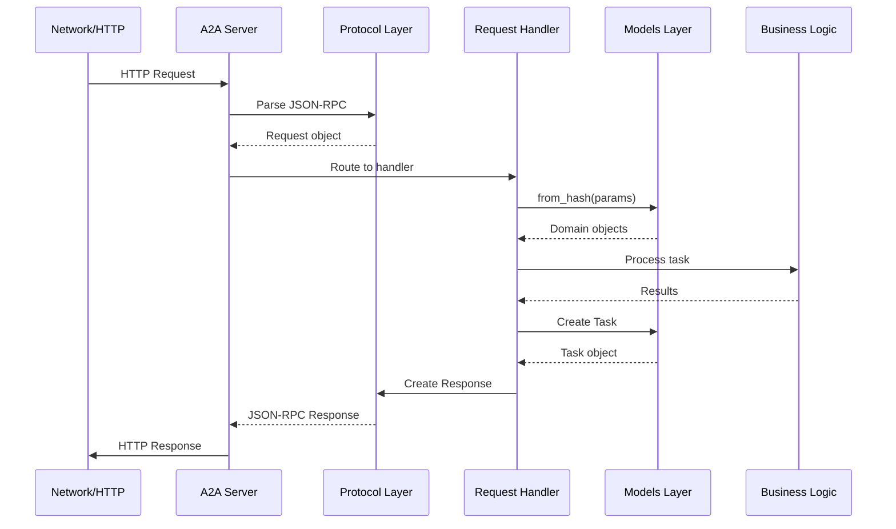
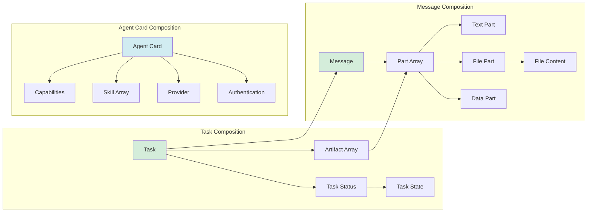

# A2A Ruby Gem - Architecture Overview

This document provides a comprehensive overview of the A2A Ruby gem's architecture, explaining how the codebase is structured and why these architectural decisions were made.

## Table of Contents

- [Introduction](#introduction)
- [High-Level Architecture](#high-level-architecture)
- [Layered Architecture](#layered-architecture)
- [Component Structure](#component-structure)
- [Directory Organization](#directory-organization)
- [Key Architectural Patterns](#key-architectural-patterns)
- [Data Flow](#data-flow)
- [Related Documentation](#related-documentation)

## Introduction

The A2A Ruby gem implements the Agent2Agent (A2A) protocol, an open protocol created by Google that enables communication and interoperability between agentic applications. The gem follows a clean, layered architecture that separates concerns and makes the codebase maintainable, testable, and extensible.

The architecture is designed around these core principles:
- **Protocol Compliance**: Strictly adheres to the A2A JSON schema specification and JSON-RPC 2.0
- **Separation of Concerns**: Clear boundaries between models, protocol, client, and server
- **Extensibility**: Easy to add new capabilities without modifying existing code
- **Type Safety**: Designed to work with RBS type definitions for enhanced reliability

## High-Level Architecture

The gem is structured as a layered architecture with four primary layers:



## Layered Architecture

### Layer 1: Models Layer (`lib/a2a/models/`)

The foundation layer containing all data models that represent the A2A protocol's domain concepts. These models are pure data structures with validation and serialization logic.

**Key Components:**
- **AgentCard**: Agent metadata and discovery information
- **Task**: Central unit of work with unique ID and state progression
- **Message**: Communication turns between user and agent
- **Parts**: Polymorphic content types (Text, File, Data)
- **Artifact**: Agent-generated outputs
- **Supporting Models**: TaskState, TaskStatus, Capabilities, Skills, etc.

### Layer 2: Protocol Layer (`lib/a2a/protocol/`)

Implements the JSON-RPC 2.0 transport protocol used by A2A. This layer is responsible for request/response formatting and error handling.

**Key Components:**
- **Request**: JSON-RPC 2.0 request wrapper
- **Response**: JSON-RPC 2.0 response wrapper
- **Error**: Protocol-level error representation

### Layer 3: Interface Layer (`lib/a2a/client/` & `lib/a2a/server/`)

Provides base classes that define the interface for building A2A clients and servers. These are abstract classes meant to be extended by concrete implementations.

**Key Components:**
- **Client::Base**: Defines client operations (discover, send_task, get_task, etc.)
- **Server::Base**: Defines server request handlers (handle_send_task, handle_get_task, etc.)

### Layer 4: Application Layer

User implementations that extend the base client and server classes to create concrete A2A applications.

## Component Structure

### Models Component Architecture



### Protocol Component Architecture



### Client/Server Architecture

```mermaid
graph TB
    subgraph "Client Layer"
        ClientBase[Client::Base<br/>Abstract Interface]
        ClientImpl[Concrete Client<br/>Implementation]
    end

    subgraph "Server Layer"
        ServerBase[Server::Base<br/>Abstract Interface]
        ServerImpl[Concrete Server<br/>Implementation]
    end

    subgraph "Protocol Methods"
        Discovery[/.well-known/agent.json]
        SendTask[tasks/send]
        SendStream[tasks/sendSubscribe]
        GetTask[tasks/get]
        CancelTask[tasks/cancel]
        SetPushNotif[tasks/pushNotification/set]
        GetPushNotif[tasks/pushNotification/get]
        Resubscribe[tasks/resubscribe]
    end

    ClientImpl -.extends.-> ClientBase
    ServerImpl -.extends.-> ServerBase

    ClientBase --> Discovery
    ClientBase --> SendTask
    ClientBase --> SendStream
    ClientBase --> GetTask
    ClientBase --> CancelTask
    ClientBase --> SetPushNotif
    ClientBase --> GetPushNotif

    ServerBase --> Discovery
    ServerBase --> SendTask
    ServerBase --> SendStream
    ServerBase --> GetTask
    ServerBase --> CancelTask
    ServerBase --> SetPushNotif
    ServerBase --> GetPushNotif
    ServerBase --> Resubscribe

    style ClientBase fill:#e1f5ff
    style ServerBase fill:#e1f5ff
    style ClientImpl fill:#cfe2ff
    style ServerImpl fill:#cfe2ff
```

## Directory Organization

The gem follows a clear directory structure that mirrors the architectural layers:

```
lib/a2a/
├── version.rb                    # Gem version constant
├── error.rb                      # Error class hierarchy
│
├── models/                       # Layer 1: Data Models
│   ├── agent_card.rb            # Agent metadata
│   ├── agent_capabilities.rb    # Agent capabilities
│   ├── agent_skill.rb           # Agent skill definition
│   ├── agent_provider.rb        # Provider information
│   ├── agent_authentication.rb  # Authentication config
│   ├── task.rb                  # Task (central unit of work)
│   ├── task_status.rb           # Task status with state
│   ├── task_state.rb            # Task state enum
│   ├── message.rb               # Communication turns
│   ├── part.rb                  # Base class for parts
│   ├── text_part.rb             # Text content
│   ├── file_part.rb             # File content
│   ├── file_content.rb          # File representation
│   ├── data_part.rb             # Structured data
│   ├── artifact.rb              # Agent outputs
│   └── push_notification_config.rb
│
├── protocol/                     # Layer 2: JSON-RPC Protocol
│   ├── request.rb               # JSON-RPC request
│   ├── response.rb              # JSON-RPC response
│   ├── error.rb                 # Protocol error
│   ├── requests/                # Specific request types (future)
│   ├── responses/               # Specific response types (future)
│   └── events/                  # SSE events (future)
│
├── client/                       # Layer 3a: Client Interface
│   └── base.rb                  # Abstract client class
│
├── server/                       # Layer 3b: Server Interface
│   └── base.rb                  # Abstract server class
│
└── utils/                        # Utilities (future)
    ├── json_schema_validator.rb
    └── serializer.rb
```

This structure provides:
- **Clear Separation**: Each layer has its own directory
- **Easy Navigation**: Related files are grouped together
- **Scalability**: New components can be added without restructuring
- **Discoverability**: Developers can quickly find what they need

## Key Architectural Patterns

### 1. Factory Pattern

The `Part` class uses the Factory pattern to create appropriate part types:

```ruby
# Part.from_hash determines which subclass to instantiate
def self.from_hash(hash)
  case hash[:type]
  when 'text' then TextPart.from_hash(hash)
  when 'file' then FilePart.from_hash(hash)
  when 'data' then DataPart.from_hash(hash)
  end
end
```

**Why**: Enables polymorphic handling of different content types while maintaining type safety.

### 2. Value Object Pattern

Models like `TaskState` and `FileContent` are immutable value objects:

```ruby
class TaskState
  attr_reader :value

  def initialize(value)
    @value = validate_state(value)
  end

  # Immutable - no setters
end
```

**Why**: Ensures data integrity and makes state transitions explicit and trackable.

### 3. Builder/Convenience Methods

Models provide convenience constructors for common use cases:

```ruby
# Message.text() provides a shorthand for text messages
def self.text(role:, text:, metadata: nil)
  new(
    role: role,
    parts: [TextPart.new(text: text)],
    metadata: metadata
  )
end
```

**Why**: Improves developer experience and reduces boilerplate code.

### 4. Template Method Pattern

Base client and server classes define the interface that subclasses must implement:

```ruby
class Base
  def send_task(task_id:, message:, session_id: nil)
    raise NotImplementedError, "Subclasses must implement #send_task"
  end
end
```

**Why**: Enforces consistent API across different implementations while allowing customization.

### 5. Data Mapper Pattern

All models implement `to_h`, `to_json`, and `from_hash` for serialization:

```ruby
class Task
  def to_h
    { id: id, status: status.to_h, artifacts: artifacts&.map(&:to_h) }.compact
  end

  def self.from_hash(hash)
    new(id: hash[:id], status: TaskStatus.from_hash(hash[:status]))
  end
end
```

**Why**: Enables seamless conversion between Ruby objects and JSON protocol messages.

## Data Flow

### Client Request Flow



### Server Request Handling Flow



### Model Composition Flow



## Related Documentation

For more detailed information, see:

- [Design Principles and Decisions](design.md) - Deep dive into design choices
- [Protocol Flow and Sequence Diagrams](flow.md) - Detailed protocol interactions
- [Gem Architecture](gem-architecture.md) - Gem architecture document
- [Getting Started Guide](../guides/getting-started.md) - How to use the gem
- [A2A Protocol Specification](../protocol-spec.md) - Official protocol docs

---

[Back to Documentation Home](../index.md)
