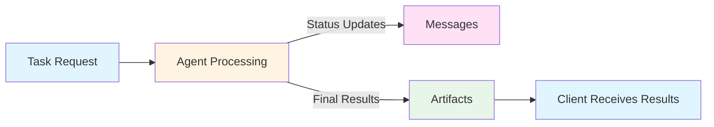

# Handling Artifacts

Artifacts represent the outputs generated by an agent during task execution. They are the primary mechanism for delivering results, files, and structured data back to clients.

## Table of Contents

- [What are Artifacts?](#what-are-artifacts)
- [Artifact Structure](#artifact-structure)
- [Creating Artifacts](#creating-artifacts)

## What are Artifacts?

Artifacts are structured outputs that agents produce as the result of processing a task. Unlike status messages (which provide updates during processing), artifacts represent the final deliverables.



### Artifacts vs Messages

| Aspect | Messages | Artifacts |
|--------|----------|-----------|
| **Purpose** | Communication/status updates | Final results/deliverables |
| **Location** | In TaskStatus | In Task.artifacts array |
| **Timing** | During processing | At completion |
| **Mutability** | Updated with each status | Accumulated over time |

## Artifact Structure

Every artifact has the following structure:

| Field | Type | Required | Description |
|-------|------|----------|-------------|
| `parts` | Array | Yes | Array of Part objects (TextPart, FilePart, DataPart) |
| `name` | String | No | Human-readable name for the artifact |
| `description` | String | No | Description of what the artifact contains |
| `index` | Integer | No | Position in artifact list (default: 0) |
| `append` | Boolean | No | Whether to append to existing artifact (streaming) |
| `last_chunk` | Boolean | No | Whether this is the final chunk (streaming) |
| `metadata` | Hash | No | Optional metadata |

```ruby
artifact = A2A::Models::Artifact.new(
  name: "Analysis Results",
  description: "Statistical analysis of sales data",
  parts: [
    A2A::Models::TextPart.new(text: "Analysis complete"),
    A2A::Models::DataPart.new(data: { total: 42 })
  ],
  index: 0,
  metadata: { generated_at: Time.now.iso8601 }
)
```

## Creating Artifacts

### Basic Text Artifact

```ruby
require 'a2a'

artifact = A2A::Models::Artifact.new(
  name: "Summary",
  parts: [
    A2A::Models::TextPart.new(
      text: "Processing completed successfully."
    )
  ]
)
```

### Data Artifact

```ruby
artifact = A2A::Models::Artifact.new(
  name: "Statistical Results",
  description: "Computed statistics from dataset",
  parts: [
    A2A::Models::DataPart.new(
      data: {
        count: 1000,
        mean: 45.5,
        median: 42.0,
        std_dev: 12.3,
        quartiles: [35, 42, 55]
      }
    )
  ]
)
```

### File Artifact

```ruby
artifact = A2A::Models::Artifact.new(
  name: "Generated Report",
  description: "PDF report with analysis results",
  parts: [
    A2A::Models::FilePart.new(
      file: {
        name: "report.pdf",
        mime_type: "application/pdf",
        uri: "https://storage.example.com/reports/2024-01-15.pdf"
      }
    )
  ]
)
```

For complete examples and advanced patterns, see the [Streaming Support](../advanced/streaming.md) guide.

## See Also

- [Messages and Parts](messages.md) - Understanding message structure
- [Working with Tasks](tasks.md) - Task lifecycle and management
- [Error Handling](errors.md) - Handle errors gracefully
- [Streaming Support](../advanced/streaming.md) - Real-time artifact streaming
- [API Reference: Models](../api/models.md) - Complete model API documentation

---

[Back to Guides](index.md) | [Home](../index.md)
