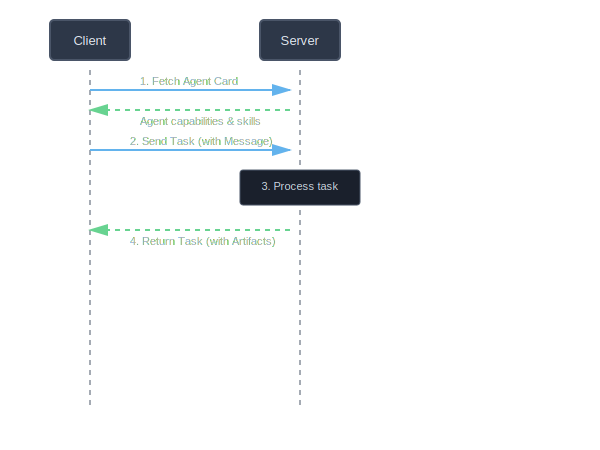

# Getting Started with A2A

This comprehensive tutorial will walk you through building your first A2A application, from installation to creating a working client-server pair.

## Prerequisites

Before you begin, ensure you have:

- Ruby 3.4.0 or higher installed
- Basic knowledge of Ruby
- Familiarity with JSON and REST APIs (helpful but not required)

## What You'll Build

In this tutorial, you'll create:

1. An A2A agent card
2. A simple message exchange
3. A basic task workflow
4. An artifact with results

## Step 1: Installation

Install the A2A gem:

```bash
gem install a2a
```

Verify the installation:

```bash
ruby -r a2a -e "puts A2A.version"
```

## Step 2: Understanding the Protocol

The A2A protocol defines how agents:

1. **Discover** each other via Agent Cards
2. **Communicate** using Messages with Parts
3. **Execute** work as Tasks
4. **Return** results as Artifacts



## Step 3: Create Your First Agent Card

Create a file called `my_agent.rb`:

```ruby
require 'a2a'
require 'json'

# Define your agent's capabilities
agent_card = A2A::Models::AgentCard.new(
  name: "Calculator Agent",
  url: "https://calculator.example.com/a2a",
  version: "1.0.0",
  description: "Performs basic mathematical operations",

  # Capabilities
  capabilities: {
    streaming: false,
    push_notifications: false,
    state_transition_history: false
  },

  # Skills
  skills: [
    {
      id: "add",
      name: "Addition",
      description: "Add two numbers",
      tags: ["math", "arithmetic"],
      examples: ["Add 5 and 3", "What is 10 + 20?"]
    },
    {
      id: "multiply",
      name: "Multiplication",
      description: "Multiply two numbers",
      tags: ["math", "arithmetic"],
      examples: ["Multiply 4 and 6", "What is 8 * 7?"]
    }
  ],

  # Provider information
  provider: {
    organization: "My Organization",
    url: "https://myorg.example.com"
  }
)

# Print the agent card as JSON
puts JSON.pretty_generate(agent_card.to_h)
```

Run it:

```bash
ruby my_agent.rb
```

## Step 4: Working with Messages

Messages represent communication turns. Create `messages_demo.rb`:

```ruby
require 'a2a'

# User asks a question
user_message = A2A::Models::Message.text(
  role: "user",
  text: "What is 15 + 27?"
)

puts "User: #{user_message.parts.first.text}"

# Agent responds with text and structured data
agent_message = A2A::Models::Message.new(
  role: "agent",
  parts: [
    A2A::Models::TextPart.new(
      text: "The answer is 42"
    ),
    A2A::Models::DataPart.new(
      data: {
        operation: "addition",
        operands: [15, 27],
        result: 42
      }
    )
  ]
)

puts "Agent (text): #{agent_message.parts[0].text}"
puts "Agent (data): #{agent_message.parts[1].data}"
```

Run it:

```bash
ruby messages_demo.rb
```

## Step 5: Task Lifecycle

Tasks progress through states. Create `task_demo.rb`:

```ruby
require 'a2a'

task_id = "task-#{Time.now.to_i}"

# 1. Task is submitted
task = A2A::Models::Task.new(
  id: task_id,
  status: {
    state: "submitted",
    timestamp: Time.now.utc.iso8601
  }
)

puts "1. Task #{task.id} is #{task.state}"
puts "   Terminal? #{task.state.terminal?}"

# 2. Task is being worked on
task = A2A::Models::Task.new(
  id: task_id,
  status: {
    state: "working",
    message: A2A::Models::Message.text(
      role: "agent",
      text: "Processing your request..."
    )
  }
)

puts "\n2. Task is now: #{task.state}"
puts "   Status message: #{task.status.message.parts.first.text}"

# 3. Task is completed with results
task = A2A::Models::Task.new(
  id: task_id,
  status: {
    state: "completed"
  },
  artifacts: [
    A2A::Models::Artifact.new(
      name: "Calculation Result",
      parts: [
        A2A::Models::DataPart.new(
          data: { result: 42 }
        )
      ]
    )
  ]
)

puts "\n3. Task is: #{task.state}"
puts "   Terminal? #{task.state.terminal?}"
puts "   Result: #{task.artifacts.first.parts.first.data}"
```

Run it:

```bash
ruby task_demo.rb
```

## Step 6: Complete Example

Now let's put it all together in `calculator.rb`:

```ruby
require 'a2a'
require 'json'

class Calculator
  def initialize
    @agent_card = create_agent_card
  end

  attr_reader :agent_card

  def process_task(task_id, message)
    # Extract the question from the message
    text = message.parts.first.text

    # Simple parsing (in real app, use NLP or structured input)
    if text =~ /(\d+)\s*\+\s*(\d+)/
      result = $1.to_i + $2.to_i
      operation = "addition"
    elsif text =~ /(\d+)\s*\*\s*(\d+)/
      result = $1.to_i * $2.to_i
      operation = "multiplication"
    else
      return create_error_task(task_id, "Could not parse mathematical expression")
    end

    # Create completed task with result
    A2A::Models::Task.new(
      id: task_id,
      status: {
        state: "completed"
      },
      artifacts: [
        A2A::Models::Artifact.new(
          name: "Calculation Result",
          parts: [
            A2A::Models::TextPart.new(
              text: "The answer is #{result}"
            ),
            A2A::Models::DataPart.new(
              data: {
                operation: operation,
                result: result,
                timestamp: Time.now.utc.iso8601
              }
            )
          ]
        )
      ]
    )
  end

  private

  def create_agent_card
    A2A::Models::AgentCard.new(
      name: "Calculator Agent",
      url: "https://calculator.example.com/a2a",
      version: "1.0.0",
      description: "Performs basic mathematical operations",
      capabilities: {
        streaming: false,
        push_notifications: false
      },
      skills: [
        {
          id: "math",
          name: "Mathematics",
          description: "Basic arithmetic operations"
        }
      ]
    )
  end

  def create_error_task(task_id, error_message)
    A2A::Models::Task.new(
      id: task_id,
      status: {
        state: "failed",
        message: A2A::Models::Message.text(
          role: "agent",
          text: error_message
        )
      }
    )
  end
end

# Demo usage
calc = Calculator.new

puts "Agent Card:"
puts JSON.pretty_generate(calc.agent_card.to_h)
puts "\n" + "="*50 + "\n"

# Process a task
user_message = A2A::Models::Message.text(
  role: "user",
  text: "What is 15 + 27?"
)

task = calc.process_task("task-123", user_message)

puts "Task Result:"
puts "State: #{task.state}"
puts "Text: #{task.artifacts.first.parts[0].text}"
puts "Data: #{task.artifacts.first.parts[1].data}"
```

Run it:

```bash
ruby calculator.rb
```

## Step 7: Error Handling

Add robust error handling to your application:

```ruby
require 'a2a'

def safe_task_creation(task_id, state)
  begin
    task = A2A::Models::Task.new(
      id: task_id,
      status: { state: state }
    )
    puts "✓ Created task with state: #{task.state}"
  rescue ArgumentError => e
    puts "✗ Error: #{e.message}"
  end
end

# Valid states
safe_task_creation("task-1", "submitted")
safe_task_creation("task-2", "completed")

# Invalid state
safe_task_creation("task-3", "invalid-state")

# Handle protocol errors
begin
  raise A2A::TaskNotFoundError
rescue A2A::JSONRPCError => e
  puts "\nProtocol Error:"
  puts "  Code: #{e.code}"
  puts "  Message: #{e.message}"
end
```

## Step 8: Multi-turn Conversations

Use session IDs to maintain context across tasks:

```ruby
require 'a2a'

session_id = "session-#{Time.now.to_i}"

# First question
task1 = A2A::Models::Task.new(
  id: "task-1",
  session_id: session_id,
  status: { state: "completed" },
  artifacts: [
    A2A::Models::Artifact.new(
      name: "Answer",
      parts: [
        A2A::Models::TextPart.new(text: "15 + 27 equals 42")
      ]
    )
  ]
)

puts "Task 1 (Session: #{task1.session_id}):"
puts "  #{task1.artifacts.first.parts.first.text}"

# Follow-up question (same session)
task2 = A2A::Models::Task.new(
  id: "task-2",
  session_id: session_id,  # Same session!
  status: { state: "completed" },
  artifacts: [
    A2A::Models::Artifact.new(
      name: "Answer",
      parts: [
        A2A::Models::TextPart.new(text: "42 * 2 equals 84")
      ]
    )
  ]
)

puts "\nTask 2 (Session: #{task2.session_id}):"
puts "  #{task2.artifacts.first.parts.first.text}"
```

## Next Steps

Now that you understand the basics, explore:

### Build More Complex Agents
- [Creating Agent Cards](agent-cards.md) - Advanced agent configuration
- [Working with Tasks](tasks.md) - Task lifecycle management
- [Messages and Parts](messages.md) - Complex message structures

### Implement Client/Server
- [Building a Client](../examples/client.md) - HTTP client implementation
- [Building a Server](../examples/server.md) - HTTP server implementation

### Advanced Features
- [Streaming Support](../advanced/streaming.md) - Real-time updates
- [Push Notifications](../advanced/push-notifications.md) - Webhook integration
- [Multi-turn Conversations](../advanced/conversations.md) - Session management

### Reference
- [API Documentation](../api/index.md) - Complete API reference
- [Examples](../examples/index.md) - More code examples

## Summary

In this tutorial, you learned:

✅ How to install and verify the A2A gem
✅ Core protocol concepts (Agent Cards, Messages, Tasks, Artifacts)
✅ How to create and work with all major data types
✅ Task lifecycle and state management
✅ Error handling
✅ Multi-turn conversations

You're now ready to build A2A applications!

---

Questions? Check the [API Reference](../api/index.md) or [Examples](../examples/index.md).
