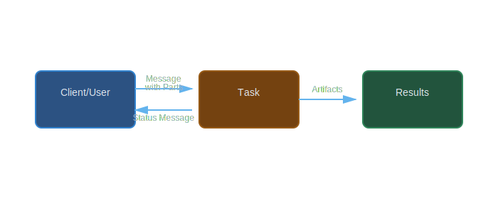

# Messages and Parts

Messages are the fundamental communication mechanism in the A2A protocol, representing individual communication turns between a client (user) and an agent. Each message contains one or more Parts that define the content being communicated.

## Table of Contents

- [Message Overview](#message-overview)
- [Message Structure](#message-structure)
- [Message Roles](#message-roles)
- [Parts: Polymorphic Content](#parts-polymorphic-content)
- [TextPart](#textpart)
- [FilePart](#filepart)
- [DataPart](#datapart)
- [Creating Messages](#creating-messages)
- [Working with Parts](#working-with-parts)
- [Advanced Patterns](#advanced-patterns)
- [Best Practices](#best-practices)
- [Examples](#examples)

## Message Overview

Messages represent communication turns in an A2A interaction. They are used in two key places:

1. **Input Messages**: User messages sent to the agent via task requests
2. **Status Messages**: Agent messages providing updates during task execution



## Message Structure

Every message has three main components:

| Field | Type | Required | Description |
|-------|------|----------|-------------|
| `role` | String | Yes | Either "user" or "agent" |
| `parts` | Array | Yes | Array of Part objects (TextPart, FilePart, DataPart) |
| `metadata` | Hash | No | Optional metadata for extensibility |

```ruby
message = A2A::Models::Message.new(
  role: "user",
  parts: [
    A2A::Models::TextPart.new(text: "Hello")
  ],
  metadata: { timestamp: Time.now.iso8601 }
)
```

## Message Roles

Messages have two valid roles:

### User Role

Represents input from the client/user:

```ruby
user_message = A2A::Models::Message.new(
  role: "user",
  parts: [
    A2A::Models::TextPart.new(
      text: "Please analyze this data"
    )
  ]
)
```

### Agent Role

Represents responses from the agent:

```ruby
agent_message = A2A::Models::Message.new(
  role: "agent",
  parts: [
    A2A::Models::TextPart.new(
      text: "Analysis complete. Results:"
    ),
    A2A::Models::DataPart.new(
      data: { summary: "Dataset contains 1000 records" }
    )
  ]
)
```

### Role Validation

The gem automatically validates message roles:

```ruby
# This will raise ArgumentError
invalid_message = A2A::Models::Message.new(
  role: "system",  # Invalid! Must be "user" or "agent"
  parts: []
)
# => ArgumentError: Invalid role: system. Must be one of: user, agent
```

## Parts: Polymorphic Content

Parts are the building blocks of messages. The A2A protocol supports three types of parts:

| Part Type | Purpose | Content Type |
|-----------|---------|--------------|
| **TextPart** | Plain text content | String |
| **FilePart** | File content (bytes or URI) | Binary or reference |
| **DataPart** | Structured JSON data | Hash/Object |

### Part Polymorphism

Parts use a type-based polymorphic design:

```ruby
# All parts inherit from Part base class
class Part
  def type
    raise NotImplementedError
  end
end

# Each subclass implements its own type
class TextPart < Part
  def type
    'text'
  end
end

class FilePart < Part
  def type
    'file'
  end
end

class DataPart < Part
  def type
    'data'
  end
end
```

## TextPart

TextPart represents plain text content - the most common type of part.

### Creating TextParts

```ruby
# Direct creation
text_part = A2A::Models::TextPart.new(
  text: "This is plain text content",
  metadata: { language: "en" }
)

# Access the text
puts text_part.text
# => "This is plain text content"

puts text_part.type
# => "text"
```

### Text Messages (Shortcut)

The `Message.text` factory method creates a single-part text message:

```ruby
# Instead of this verbose approach:
message = A2A::Models::Message.new(
  role: "user",
  parts: [
    A2A::Models::TextPart.new(text: "Hello")
  ]
)

# Use this shortcut:
message = A2A::Models::Message.text(
  role: "user",
  text: "Hello"
)
```

### Multi-paragraph Text

```ruby
long_text = <<~TEXT
  This is a multi-paragraph message.

  It can contain multiple lines
  and paragraphs.

  The TextPart preserves formatting.
TEXT

message = A2A::Models::Message.text(
  role: "user",
  text: long_text
)
```

### Markdown Content

```ruby
markdown_text = <<~MARKDOWN
  # Analysis Results

  ## Summary
  - Total records: 1,000
  - Valid records: 985
  - Invalid records: 15

  ## Recommendations
  1. Review invalid records
  2. Reprocess data
MARKDOWN

message = A2A::Models::Message.text(
  role: "agent",
  text: markdown_text,
  metadata: { format: "markdown" }
)
```

## FilePart

FilePart represents file content, either as base64-encoded bytes or as a URI reference.

### File Content Structure

Every FilePart contains a FileContent object with:

| Field | Type | Required | Description |
|-------|------|----------|-------------|
| `name` | String | No | Filename |
| `mime_type` | String | No | MIME type (e.g., "text/csv", "image/png") |
| `bytes` | String | Yes* | Base64-encoded file content |
| `uri` | String | Yes* | URI to file location |

*Either `bytes` or `uri` must be provided, but not both.

### FilePart with URI Reference

Best for large files or files hosted elsewhere:

```ruby
require 'a2a'

file_part = A2A::Models::FilePart.new(
  file: {
    name: "dataset.csv",
    mime_type: "text/csv",
    uri: "https://example.com/data/dataset.csv"
  },
  metadata: { size_bytes: 1024000 }
)

puts file_part.file.name
# => "dataset.csv"

puts file_part.file.uri
# => "https://example.com/data/dataset.csv"
```

### FilePart with Inline Bytes

Best for small files that should be embedded:

```ruby
require 'a2a'
require 'base64'

# Read a file
file_content = File.binread("report.pdf")

# Create FilePart with inline bytes
file_part = A2A::Models::FilePart.new(
  file: {
    name: "report.pdf",
    mime_type: "application/pdf",
    bytes: Base64.strict_encode64(file_content)
  }
)

# Decode bytes back to original
decoded = Base64.strict_decode64(file_part.file.bytes)
```

### Images as FileParts

```ruby
require 'base64'

# PNG image by URI
image_uri = A2A::Models::FilePart.new(
  file: {
    name: "chart.png",
    mime_type: "image/png",
    uri: "https://example.com/charts/sales-2024.png"
  }
)

# JPEG image as inline bytes
image_data = File.binread("photo.jpg")
image_bytes = A2A::Models::FilePart.new(
  file: {
    name: "photo.jpg",
    mime_type: "image/jpeg",
    bytes: Base64.strict_encode64(image_data)
  }
)
```

### CSV Files

```ruby
csv_part = A2A::Models::FilePart.new(
  file: {
    name: "results.csv",
    mime_type: "text/csv",
    uri: "https://storage.example.com/results/2024-01-15.csv"
  },
  metadata: {
    rows: 1000,
    columns: 12,
    generated_at: Time.now.iso8601
  }
)
```

### FileContent Validation

The FileContent class enforces that exactly one of bytes or uri is provided:

```ruby
# This will raise ArgumentError
invalid_file = A2A::Models::FilePart.new(
  file: {
    name: "file.txt"
    # Missing both bytes and uri!
  }
)
# => ArgumentError: Either bytes or uri must be provided

# This will also raise ArgumentError
invalid_file = A2A::Models::FilePart.new(
  file: {
    name: "file.txt",
    bytes: "...",
    uri: "..."  # Cannot provide both!
  }
)
# => ArgumentError: Only one of bytes or uri can be provided, not both
```

## DataPart

DataPart represents structured JSON data - perfect for forms, structured results, or machine-readable content.

### Creating DataParts

```ruby
data_part = A2A::Models::DataPart.new(
  data: {
    user_id: 12345,
    name: "John Doe",
    email: "john@example.com",
    preferences: {
      theme: "dark",
      notifications: true
    }
  },
  metadata: { schema_version: "1.0" }
)

puts data_part.data[:name]
# => "John Doe"

puts data_part.type
# => "data"
```

### Form Data

```ruby
form_data = A2A::Models::DataPart.new(
  data: {
    form_type: "user_registration",
    fields: [
      {
        name: "email",
        type: "email",
        required: true,
        value: nil
      },
      {
        name: "password",
        type: "password",
        required: true,
        value: nil
      },
      {
        name: "age",
        type: "number",
        required: false,
        value: nil
      }
    ]
  }
)
```

### Analysis Results

```ruby
analysis_data = A2A::Models::DataPart.new(
  data: {
    analysis_type: "sentiment",
    results: {
      positive: 0.75,
      negative: 0.15,
      neutral: 0.10
    },
    confidence: 0.92,
    processed_at: Time.now.utc.iso8601
  }
)
```

### Structured Errors

```ruby
error_data = A2A::Models::DataPart.new(
  data: {
    error_code: "VALIDATION_FAILED",
    error_message: "Input validation failed",
    fields: {
      email: ["Must be a valid email address"],
      age: ["Must be between 0 and 120"]
    }
  }
)
```

### Complex Nested Data

```ruby
complex_data = A2A::Models::DataPart.new(
  data: {
    dataset: {
      name: "Sales Data 2024",
      records: 1000,
      schema: {
        columns: [
          { name: "date", type: "datetime" },
          { name: "product", type: "string" },
          { name: "revenue", type: "decimal" }
        ]
      }
    },
    statistics: {
      total_revenue: 125000.50,
      average_sale: 125.00,
      top_products: [
        { name: "Widget A", sales: 450 },
        { name: "Widget B", sales: 320 }
      ]
    }
  }
)
```

## Creating Messages

### Simple Text Message

```ruby
message = A2A::Models::Message.text(
  role: "user",
  text: "What is the weather today?"
)
```

### Multi-Part Message

```ruby
message = A2A::Models::Message.new(
  role: "user",
  parts: [
    A2A::Models::TextPart.new(
      text: "Please analyze this dataset:"
    ),
    A2A::Models::FilePart.new(
      file: {
        name: "data.csv",
        mime_type: "text/csv",
        uri: "https://example.com/data.csv"
      }
    ),
    A2A::Models::DataPart.new(
      data: {
        analysis_type: "statistical",
        include_charts: true
      }
    )
  ]
)
```

### Message with Metadata

```ruby
message = A2A::Models::Message.text(
  role: "agent",
  text: "Processing complete",
  metadata: {
    processing_time_ms: 1250,
    model_version: "2.1.0",
    confidence: 0.95
  }
)
```

## Working with Parts

### Iterating Over Parts

```ruby
message = A2A::Models::Message.new(
  role: "agent",
  parts: [
    A2A::Models::TextPart.new(text: "Results:"),
    A2A::Models::DataPart.new(data: { count: 42 }),
    A2A::Models::FilePart.new(
      file: { name: "report.pdf", uri: "https://..." }
    )
  ]
)

# Iterate over all parts
message.parts.each do |part|
  puts "Part type: #{part.type}"

  case part.type
  when 'text'
    puts "  Text: #{part.text}"
  when 'data'
    puts "  Data: #{part.data.inspect}"
  when 'file'
    puts "  File: #{part.file.name}"
  end
end
```

### Finding Specific Part Types

```ruby
# Find all text parts
text_parts = message.parts.select { |p| p.type == 'text' }

# Find all file parts
file_parts = message.parts.select { |p| p.type == 'file' }

# Find first data part
data_part = message.parts.find { |p| p.type == 'data' }
```

### Extracting Text Content

```ruby
# Get all text from a message
all_text = message.parts
  .select { |p| p.is_a?(A2A::Models::TextPart) }
  .map(&:text)
  .join("\n\n")

puts all_text
```

### Extracting Data Content

```ruby
# Combine all data parts
all_data = message.parts
  .select { |p| p.is_a?(A2A::Models::DataPart) }
  .map(&:data)

# Merge data parts (if they're hashes)
merged_data = all_data.reduce({}) do |acc, data|
  acc.merge(data)
end
```

## Advanced Patterns

### Pattern: Mixed Content Message

Combine text explanation with structured data and file attachments:

```ruby
def create_analysis_response(text, statistics, chart_uri)
  A2A::Models::Message.new(
    role: "agent",
    parts: [
      A2A::Models::TextPart.new(
        text: text
      ),
      A2A::Models::DataPart.new(
        data: statistics
      ),
      A2A::Models::FilePart.new(
        file: {
          name: "chart.png",
          mime_type: "image/png",
          uri: chart_uri
        }
      )
    ]
  )
end

response = create_analysis_response(
  "Analysis shows strong positive trend in Q4 2024.",
  {
    revenue: 125000,
    growth_rate: 0.15,
    top_category: "Electronics"
  },
  "https://storage.example.com/charts/q4-2024.png"
)
```

### Pattern: Serialization and Deserialization

```ruby
require 'json'

# Create a message
message = A2A::Models::Message.new(
  role: "user",
  parts: [
    A2A::Models::TextPart.new(text: "Hello"),
    A2A::Models::DataPart.new(data: { foo: "bar" })
  ]
)

# Convert to hash
hash = message.to_h

# Serialize to JSON
json_string = JSON.generate(hash)
puts json_string

# Deserialize from JSON
parsed_hash = JSON.parse(json_string, symbolize_names: true)
restored_message = A2A::Models::Message.from_hash(parsed_hash)

# Verify
puts restored_message.role
# => "user"

puts restored_message.parts.first.text
# => "Hello"
```

### Pattern: Progressive Message Building

```ruby
class MessageBuilder
  def initialize(role)
    @role = role
    @parts = []
    @metadata = {}
  end

  def add_text(text)
    @parts << A2A::Models::TextPart.new(text: text)
    self
  end

  def add_file(name:, mime_type:, uri: nil, bytes: nil)
    file_content = { name: name, mime_type: mime_type }
    file_content[:uri] = uri if uri
    file_content[:bytes] = bytes if bytes

    @parts << A2A::Models::FilePart.new(file: file_content)
    self
  end

  def add_data(data)
    @parts << A2A::Models::DataPart.new(data: data)
    self
  end

  def with_metadata(metadata)
    @metadata.merge!(metadata)
    self
  end

  def build
    A2A::Models::Message.new(
      role: @role,
      parts: @parts,
      metadata: @metadata.empty? ? nil : @metadata
    )
  end
end

# Usage
message = MessageBuilder.new("agent")
  .add_text("Here are your results:")
  .add_data({ count: 42, status: "success" })
  .add_file(
    name: "details.json",
    mime_type: "application/json",
    uri: "https://example.com/results.json"
  )
  .with_metadata({ processing_time: 150 })
  .build
```

### Pattern: Message Validation

```ruby
def validate_message(message)
  errors = []

  # Check role
  unless ['user', 'agent'].include?(message.role)
    errors << "Invalid role: #{message.role}"
  end

  # Check parts
  if message.parts.empty?
    errors << "Message must have at least one part"
  end

  # Validate each part
  message.parts.each_with_index do |part, index|
    case part
    when A2A::Models::TextPart
      if part.text.nil? || part.text.empty?
        errors << "Part #{index}: Text cannot be empty"
      end
    when A2A::Models::FilePart
      if part.file.name.nil?
        errors << "Part #{index}: File name is missing"
      end
    when A2A::Models::DataPart
      if part.data.nil?
        errors << "Part #{index}: Data cannot be nil"
      end
    end
  end

  errors
end

# Usage
message = A2A::Models::Message.text(role: "user", text: "")
errors = validate_message(message)
if errors.any?
  puts "Validation errors:"
  errors.each { |e| puts "  - #{e}" }
end
```

### Pattern: Part Type Filtering

```ruby
class MessageAnalyzer
  def initialize(message)
    @message = message
  end

  def text_parts
    @message.parts.select { |p| p.is_a?(A2A::Models::TextPart) }
  end

  def file_parts
    @message.parts.select { |p| p.is_a?(A2A::Models::FilePart) }
  end

  def data_parts
    @message.parts.select { |p| p.is_a?(A2A::Models::DataPart) }
  end

  def has_text?
    text_parts.any?
  end

  def has_files?
    file_parts.any?
  end

  def has_data?
    data_parts.any?
  end

  def summary
    {
      role: @message.role,
      total_parts: @message.parts.size,
      text_parts: text_parts.size,
      file_parts: file_parts.size,
      data_parts: data_parts.size
    }
  end
end

# Usage
message = A2A::Models::Message.new(
  role: "agent",
  parts: [
    A2A::Models::TextPart.new(text: "Results"),
    A2A::Models::DataPart.new(data: { count: 10 }),
    A2A::Models::FilePart.new(file: { name: "f.csv", uri: "..." })
  ]
)

analyzer = MessageAnalyzer.new(message)
puts analyzer.summary.inspect
# => {:role=>"agent", :total_parts=>3, :text_parts=>1, :file_parts=>1, :data_parts=>1}
```

## Best Practices

### 1. Use Factory Methods

```ruby
# Good: Use factory method for simple text messages
message = A2A::Models::Message.text(role: "user", text: "Hello")

# Verbose: Manual construction
message = A2A::Models::Message.new(
  role: "user",
  parts: [A2A::Models::TextPart.new(text: "Hello")]
)
```

### 2. Choose Appropriate Part Types

```ruby
# Good: Use DataPart for structured data
A2A::Models::DataPart.new(
  data: { temperature: 72, unit: "fahrenheit" }
)

# Bad: Don't encode structured data as text
A2A::Models::TextPart.new(
  text: '{"temperature": 72, "unit": "fahrenheit"}'
)
```

### 3. Use URI for Large Files

```ruby
# Good: URI reference for large files
A2A::Models::FilePart.new(
  file: {
    name: "large-dataset.csv",
    mime_type: "text/csv",
    uri: "https://storage.example.com/datasets/large.csv"
  }
)

# Bad: Embedding large files as bytes (inefficient)
large_content = File.binread("large-dataset.csv")  # 100MB file!
A2A::Models::FilePart.new(
  file: {
    name: "large-dataset.csv",
    mime_type: "text/csv",
    bytes: Base64.strict_encode64(large_content)  # Huge base64 string!
  }
)
```

### 4. Add Metadata for Context

```ruby
# Good: Include helpful metadata
message = A2A::Models::Message.text(
  role: "agent",
  text: "Processing complete",
  metadata: {
    processing_time_ms: 1500,
    model_version: "2.1.0",
    timestamp: Time.now.utc.iso8601
  }
)
```

### 5. Set Correct MIME Types

```ruby
# Good: Accurate MIME types
A2A::Models::FilePart.new(
  file: {
    name: "report.pdf",
    mime_type: "application/pdf",
    uri: "..."
  }
)

A2A::Models::FilePart.new(
  file: {
    name: "data.json",
    mime_type: "application/json",
    uri: "..."
  }
)
```

### 6. Validate Before Sending

```ruby
def safe_message_creation(role, parts)
  begin
    message = A2A::Models::Message.new(
      role: role,
      parts: parts
    )
    puts "Message created successfully"
    message
  rescue ArgumentError => e
    puts "Validation error: #{e.message}"
    nil
  end
end
```

## Examples

### Example 1: User Question

```ruby
require 'a2a'

message = A2A::Models::Message.text(
  role: "user",
  text: "What is the capital of France?"
)

puts "Role: #{message.role}"
puts "Text: #{message.parts.first.text}"
```

### Example 2: Agent Response with Data

```ruby
require 'a2a'

message = A2A::Models::Message.new(
  role: "agent",
  parts: [
    A2A::Models::TextPart.new(
      text: "The capital of France is Paris."
    ),
    A2A::Models::DataPart.new(
      data: {
        city: "Paris",
        country: "France",
        population: 2_161_000,
        coordinates: {
          latitude: 48.8566,
          longitude: 2.3522
        }
      }
    )
  ]
)

text = message.parts[0].text
data = message.parts[1].data

puts text
puts "Population: #{data[:population].to_s.reverse.gsub(/(\d{3})(?=\d)/, '\\1,').reverse}"
```

### Example 3: File Upload Request

```ruby
require 'a2a'
require 'base64'

# Read a CSV file
csv_content = File.read("sales_data.csv")

message = A2A::Models::Message.new(
  role: "user",
  parts: [
    A2A::Models::TextPart.new(
      text: "Please analyze this sales data and provide insights."
    ),
    A2A::Models::FilePart.new(
      file: {
        name: "sales_data.csv",
        mime_type: "text/csv",
        bytes: Base64.strict_encode64(csv_content)
      }
    ),
    A2A::Models::DataPart.new(
      data: {
        analysis_options: {
          include_trends: true,
          time_period: "monthly",
          metrics: ["revenue", "units_sold", "profit_margin"]
        }
      }
    )
  ]
)

puts "Message with #{message.parts.size} parts created"
```

### Example 4: Multi-part Agent Response

```ruby
require 'a2a'

# Simulate agent providing analysis with chart
message = A2A::Models::Message.new(
  role: "agent",
  parts: [
    A2A::Models::TextPart.new(
      text: <<~TEXT
        # Sales Analysis Results

        I've analyzed your sales data for Q4 2024. Here are the key findings:

        - Total Revenue: $125,000
        - Growth Rate: 15% compared to Q3
        - Top Product: Widget A (450 units)

        See the attached chart for visual representation.
      TEXT
    ),
    A2A::Models::DataPart.new(
      data: {
        period: "Q4 2024",
        total_revenue: 125000,
        growth_rate: 0.15,
        top_products: [
          { name: "Widget A", units: 450, revenue: 45000 },
          { name: "Widget B", units: 320, revenue: 38400 },
          { name: "Widget C", units: 280, revenue: 30800 }
        ],
        recommendations: [
          "Increase inventory for Widget A",
          "Consider promotion for Widget C",
          "Monitor Widget B pricing"
        ]
      }
    ),
    A2A::Models::FilePart.new(
      file: {
        name: "q4_sales_chart.png",
        mime_type: "image/png",
        uri: "https://storage.example.com/charts/q4-2024-sales.png"
      }
    )
  ],
  metadata: {
    analysis_completed_at: Time.now.utc.iso8601,
    processing_time_seconds: 3.5
  }
)

puts "Created comprehensive response with:"
puts "  - #{message.parts.count { |p| p.is_a?(A2A::Models::TextPart) }} text part(s)"
puts "  - #{message.parts.count { |p| p.is_a?(A2A::Models::DataPart) }} data part(s)"
puts "  - #{message.parts.count { |p| p.is_a?(A2A::Models::FilePart) }} file part(s)"
```

### Example 5: Form Input Message

```ruby
require 'a2a'

# User submitting a form via DataPart
message = A2A::Models::Message.new(
  role: "user",
  parts: [
    A2A::Models::TextPart.new(
      text: "I'd like to register a new account."
    ),
    A2A::Models::DataPart.new(
      data: {
        form_type: "user_registration",
        fields: {
          email: "user@example.com",
          username: "johndoe",
          full_name: "John Doe",
          preferences: {
            newsletter: true,
            notifications: {
              email: true,
              sms: false
            }
          }
        }
      }
    )
  ]
)

# Extract form data
data_part = message.parts.find { |p| p.is_a?(A2A::Models::DataPart) }
form_data = data_part.data

puts "Registration for: #{form_data[:fields][:email]}"
```

### Example 6: Error Response

```ruby
require 'a2a'

# Agent returning an error with structured details
error_message = A2A::Models::Message.new(
  role: "agent",
  parts: [
    A2A::Models::TextPart.new(
      text: "Unable to process your request due to validation errors."
    ),
    A2A::Models::DataPart.new(
      data: {
        error_type: "validation_error",
        error_code: "INVALID_INPUT",
        errors: [
          {
            field: "email",
            message: "Email address is not valid",
            received: "not-an-email"
          },
          {
            field: "age",
            message: "Age must be between 0 and 120",
            received: 150
          }
        ],
        timestamp: Time.now.utc.iso8601
      }
    )
  ]
)

# Extract error details
error_data = error_message.parts
  .find { |p| p.is_a?(A2A::Models::DataPart) }
  .data

puts "Error: #{error_data[:error_code]}"
error_data[:errors].each do |err|
  puts "  - #{err[:field]}: #{err[:message]}"
end
```

## See Also

- [Working with Tasks](tasks.md) - Task lifecycle and management
- [Handling Artifacts](artifacts.md) - Working with agent outputs
- [Creating Agent Cards](agent-cards.md) - Define agent capabilities
- [Error Handling](errors.md) - Handle errors gracefully
- [API Reference: Models](../api/models.md) - Complete model API documentation

---

[Back to Guides](index.md) | [Home](../index.md)
