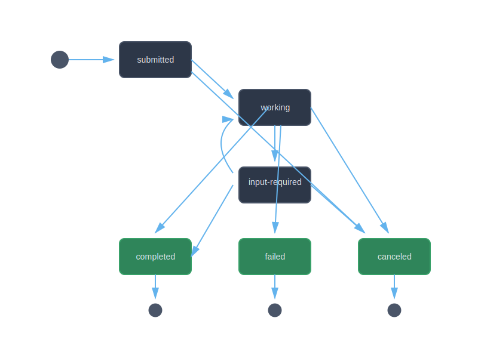

# Working with Tasks

Tasks are the central unit of work in the A2A protocol. They represent a piece of work requested by a client and processed by an agent.

## Task Lifecycle



## Task States

- **submitted**: Task has been received but not yet started
- **working**: Agent is actively processing the task
- **input-required**: Agent needs additional input from the user
- **completed**: Task finished successfully
- **failed**: Task encountered an error
- **canceled**: Task was canceled by request
- **unknown**: State is unknown (rare)

## Creating Tasks

```ruby
require 'a2a'

task = A2A::Models::Task.new(
  id: "task-#{SecureRandom.uuid}",
  session_id: "session-123",  # Optional, for multi-turn
  status: {
    state: "submitted",
    timestamp: Time.now.utc.iso8601
  }
)
```

## Checking Task State

```ruby
# Use helper methods
task.state.submitted?  # => true
task.state.working?    # => false
task.state.completed?  # => false
task.state.terminal?   # => false

# Terminal states
terminal_states = ["completed", "failed", "canceled"]
```

## See Also
- [Getting Started Guide](getting-started.md)
- [Messages and Parts](messages.md)
- [Multi-turn Conversations](../advanced/conversations.md)
