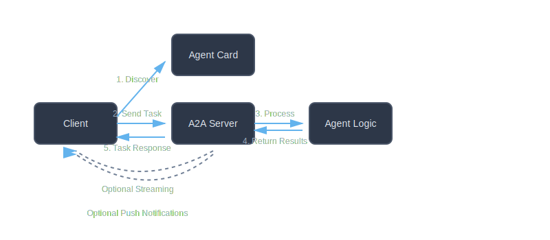

# A2A - Agent to Agent Protocol

<table border="0">
<tr>
<td width="30%" valign="top">
  <div align="center">
      
  </div>
</td>
<td width="70%" valign="top">

Welcome to **A2A**, a Ruby implementation of the Agent to Agent protocol for enabling communication and interoperability between AI agents.
<br/><br/>
The A2A (Agent to Agent) protocol is an open standard enabling communication between independent agentic applications. This Ruby gem provides a complete implementation including core data models, JSON-RPC 2.0 messaging, and base classes for building A2A clients and servers.
</td>
</tr>
</table>

  <div align="center">
      Build interoperable AI agents that speak the same language
  </div>

## Key Features

### 🏗 Complete Protocol Implementation
- **Full A2A Specification**: Implements the complete A2A JSON schema
- **JSON-RPC 2.0**: Standards-compliant request/response messaging
- **Rich Data Models**: AgentCard, Task, Message, Artifact, and polymorphic Part types
- **Type Safe**: Designed for use with RBS type definitions

### 🔌 Flexible Architecture
- **Client & Server Base Classes**: Build your own A2A implementations
- **Extensible Design**: Easy to add new part types and capabilities
- **Clean Separation**: Models, protocol, client, and server are independently testable
- **Framework Agnostic**: Works with any Ruby web framework

### 🚀 Advanced Capabilities
- **Task Lifecycle Management**: Complete state machine for task progression
- **Multi-turn Conversations**: Session support for ongoing interactions
- **Streaming Support**: Base classes ready for Server-Sent Events (SSE)
- **Push Notifications**: Webhook configuration for proactive updates
- **Error Handling**: Comprehensive error hierarchy

### 💎 Developer Friendly
- **Well Documented**: Extensive API documentation and examples
- **Clean APIs**: Intuitive, Ruby-idiomatic interfaces
- **Tested**: Designed for comprehensive test coverage
- **Examples Included**: Working examples for common use cases

## Quick Start

### Installation

```bash
gem install a2a
```

### Create an Agent Card

```ruby
require 'a2a'

agent_card = A2A::Models::AgentCard.new(
  name: "My Agent",
  url: "https://example.com/a2a",
  version: "1.0.0",
  capabilities: {
    streaming: true,
    push_notifications: false
  },
  skills: [
    {
      id: "text-analysis",
      name: "Text Analysis",
      description: "Analyze and process text content"
    }
  ]
)
```

### Work with Tasks and Messages

```ruby
# Create a user message
message = A2A::Models::Message.text(
  role: "user",
  text: "Analyze this document"
)

# Create a task
task = A2A::Models::Task.new(
  id: "task-123",
  status: { state: "submitted" }
)

# Check task state
puts task.state.submitted?  # => true
```

## Protocol Overview

The A2A protocol defines how AI agents discover each other, exchange messages, manage tasks, and deliver results:



### Core Concepts

- **Agent Card**: Metadata describing an agent's capabilities and endpoint
- **Task**: Central unit of work with unique ID and lifecycle states
- **Message**: Communication turns between user and agent
- **Parts**: Polymorphic content (Text, File, Data)
- **Artifacts**: Agent-generated outputs

## Architecture

The gem is organized into clean, testable layers:

```
lib/a2a/
├── models/          # Data models from A2A spec
│   ├── agent_card.rb, task.rb, message.rb...
├── protocol/        # JSON-RPC implementation
│   ├── request.rb, response.rb, error.rb
├── client/          # Client base class
│   └── base.rb
├── server/          # Server base class
│   └── base.rb
└── utils/           # Utilities
```

See the [Architecture Guide](architecture/index.md) for detailed information.

## Documentation Structure

### Getting Started
- [Installation](installation.md) - Get A2A up and running
- [Quick Start](quickstart.md) - Build your first A2A integration
- [Getting Started Guide](guides/getting-started.md) - Comprehensive tutorial

### Guides
- [Creating Agent Cards](guides/agent-cards.md) - Define your agent's capabilities
- [Working with Tasks](guides/tasks.md) - Task lifecycle and management
- [Messages and Parts](guides/messages.md) - Communication between agents
- [Handling Artifacts](guides/artifacts.md) - Working with agent outputs
- [Error Handling](guides/errors.md) - Robust error management

### API Reference
- [Models](api/models.md) - Complete model API documentation
- [Protocol](api/protocol.md) - JSON-RPC protocol classes
- [Client](api/client.md) - Client base class reference
- [Server](api/server.md) - Server base class reference

### Examples
- [Basic Usage](examples/basic.md) - Common patterns and examples
- [Building a Client](examples/client.md) - Implement an A2A client
- [Building a Server](examples/server.md) - Implement an A2A server

## Community & Support

- **GitHub**: [madbomber/a2a](https://github.com/madbomber/a2a)
- **Issues**: [Report bugs and request features](https://github.com/madbomber/a2a/issues)
- **RubyGems**: [a2a gem](https://rubygems.org/gems/a2a)
- **Protocol Spec**: [A2A Protocol Specification](https://github.com/google/A2A)

## What's the A2A Protocol?

The Agent to Agent (A2A) protocol is an open standard created by Google and the community to enable communication between AI agents built on different frameworks and platforms. It provides:

- **Standard Discovery**: Agents publish capabilities via Agent Cards
- **Task Management**: Structured workflow for agent interactions
- **Multi-modal Support**: Text, files, and structured data
- **Real-time Updates**: Streaming and push notifications
- **Interoperability**: Framework and vendor agnostic

Learn more about the protocol at [google.github.io/A2A](https://google.github.io/A2A).

## License

A2A is open source software. See the [LICENSE](https://github.com/madbomber/a2a/blob/main/LICENSE.txt) file for details.

---

Ready to get started? Head to the [Installation](installation.md) guide to begin!
